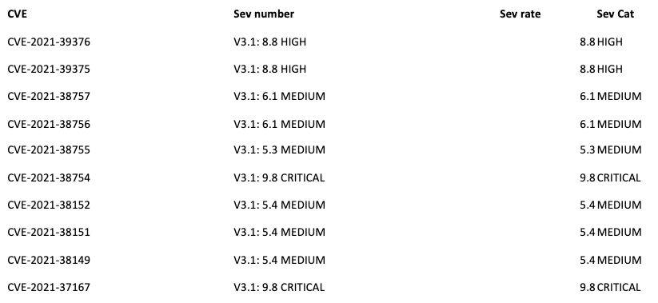
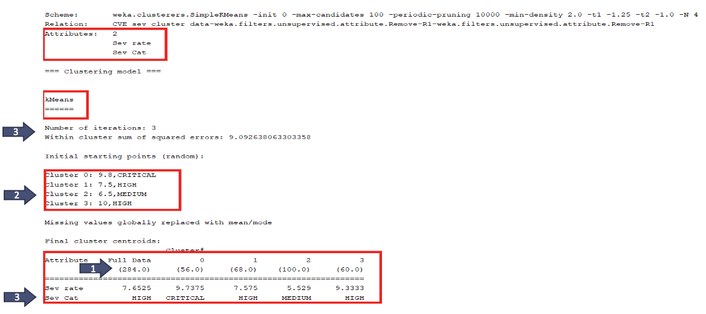
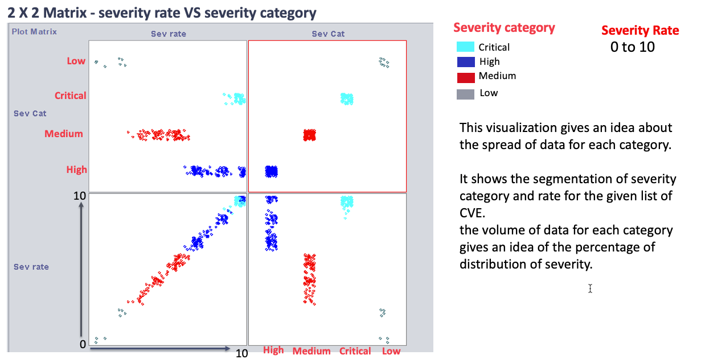

<FeatureCard
  title="Approach 3 - Cluster Vulnerabilities Based on Criticality"
  color="dark"
  >

</FeatureCard>

The CVE program is used to identify, define and catalog publicly disclosed cybersecurity vulnerabilities. Every CVE is tagged with “Common Vulnerability Scoring System (CVSS) for communicating the characteristic and severity of software vulnerabilities. CVSS is well suited as a standard measurement for industries, organization that need accurate and consistent vulnerability severity scores. Two common uses of CVSS are calculating the severity of vulnerabilities discovered on one’s system and as a factor of prioritization of vulnerability remediation activities.

For our analysis, CVE for medical related hardware and software data were extracted from MITRE, and the relevant CVSS for these CVE was extracted from National vulnerability database (NDV). This data was then clustered based on the severity rate and category which will provide a visual representation to understand the volume of data for each category and give an idea of the percentage of distribution of severity.

***

Procedure: Below is sample data showing the severity rate and severity category for CVE. This data was then uploaded into Weka and in preprocessing of the data, only Severity rate ( discrete ) and severity category (ordinal) was considered for clustering. SimpleKMeans algorithm was used for clustering.

***

Kmeans algorithm is an iterative algorithm that tries to partition the dataset into K pre-defined distinct non-overlapping subgroups (clusters) where each data point belongs to only one group.

**Steps Taken for the Algorithm**:
1. 284 records was used (full data)
2. Data was clustered into 4 groups with initial starting point. K-means algorithm identifies 4 number of centroids, and then allocates every data point to the nearest cluster.
3. After 3 iterations, the centroid for each cluster is defined and clustered accordingly.

***

