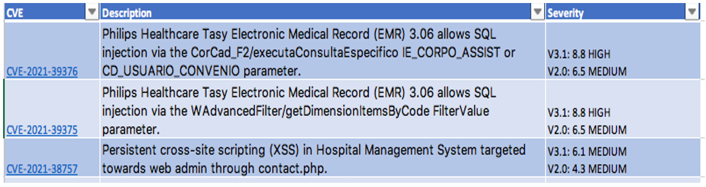
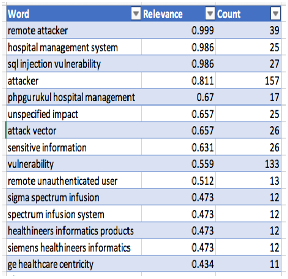

<FeatureCard
  title="Approach 2 - Text Mining of Description in CVE List"
  color="dark"
  >

</FeatureCard>

Our team linked the G2 and the Greenlight Guru dataset (both datasets include information about hospital software and medical device manufactures) to the MITRE CVE dataset. This new dataset displays information security vulnerabilities and exposures only relevant to the hospital industry. We wanted to examine and analyze the relevancy/rareness (TF-IDF) of the key words identified in the “Description” column of this new dataset. Examples of the new CVE data that pertains specifically to the hospital industry can be seen in the picture below.

***

The data sources utilized for this approach was a combination of the G2, Greenlight Guru and CVE MITRE dataset (all of these datasets were identified in Milestone 2 under the Data Source Identification & Justification slide). A step-by-step analysis of this analytical approach can be seen below.

Steps taken:
1. We linked the G2 and Greenlight Guru datasets to the MITRE CVE dataset to create one new dataset that pertains specifically to the hospital industry.
2. We then selected the “Description” column data in the new dataset and saved it as a .txt file.
3. We imported the .txt file into a text analysis/mining tool called MonkeyLearn. MonkeyLearn is a platform that allows users to analyze text using AI in order to gain valuable insight.
4. The text analysis is then run on MonkeyLearn to draw insight (note: MonkeyLearn automatically eliminates stop-words from appearing in our analysis).
5. After the analysis, we exported the ranking list to a csv file where we can analyze our findings (see the first 15 records of data on the next slide).
6. We also created a word cloud on MonkeyLearn to see if the visual can provide further insight into our analysis (see the word cloud in the preliminary visualization slide).

***

- The first column “Word” shows the word that has been identified in the analysis,
- The second column “Relevance” is a score given to indicate how relevant/rare that word is. This is calculated by multiplying the term frequency (TF) by the inverse document frequency (IDF) score (this calculation is also known as weight). The higher the number is the more relevant it is.
- The third column “Count” shows the frequency of each word in the text.
