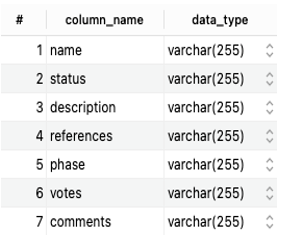

<FeatureCard
  title="Data Display 3 - G2"
  color="dark"
  >

</FeatureCard>

<AnchorLinks>
  <AnchorLink>Description</AnchorLink>
  <AnchorLink>Metadata</AnchorLink>
  <AnchorLink>Data</AnchorLink>

</AnchorLinks>

***

## Description

The organization 'G2' provides authentic reviews about thousands of medical software products. It helps to identify the different medical software applications which are used by the hospitals. They are software specific of Hospital sector, including software of different categories, for example: Patient Portal, Electronic Health Records.

Number of Unique Records: 281

Date: Extracted from G2 on October 3rd, 2021

***

## Metadata

***

## Data

| name | url | review_users | review_rate | sw_category | id |
| --- | --- | --- | --- | --- | --- |
| Epic|https://www.g2.com/products/epic/reviews|-878|4.2  out of  5|EHR |1|
| Cerner|https://www.g2.com/products/cerner/reviews|-225|3.5  out of  5|EHR |2|
| WebPT|https://www.g2.com/products/webpt/reviews|-149|4.4  out of  5|EHR |3|
| eClinicalWorks|https://www.g2.com/products/eclinicalworks/reviews|-131|3.6  out of  5|EHR |4|
| Modernizing Medicine|https://www.g2.com/products/modernizing-medicine-2021-04-01/reviews|-10|5.0  out of  5|EHR |5|
| Allscripts|https://www.g2.com/products/allscripts-allscripts/reviews|-13|4.5  out of  5|EHR |6|
| Meditech Expanse|https://www.g2.com/products/meditech-expanse/reviews|-115|3.1  out of  5|EHR |7|
| TherapyNotes|https://www.g2.com/products/therapynotes/reviews|-73|4.4  out of  5|EHR |8|
| NextGen Healthcare EHR|https://www.g2.com/products/nextgen-healthcare-ehr/reviews|-109|3.4  out of  5|EHR |9|
| Centricity EMR|https://www.g2.com/products/ge1-centricity-emr/reviews|-26|3.7  out of  5|EHR |10|
| Allscripts EHR|https://www.g2.com/products/allscripts-ehr/reviews|-86|3.2  out of  5|EHR |11|
| AdvancedEHR|https://www.g2.com/products/advancedehr/reviews|-24|3.3  out of  5|EHR |12|
| EHR Your Way|https://www.g2.com/products/ehr-your-way/reviews|-18|4.7  out of  5|EHR |13|
| athenaClinicals|https://www.g2.com/products/athenaclinicals/reviews|-24|3.7  out of  5|EHR |14|
| ChiroTouch|https://www.g2.com/products/chirotouch/reviews|-68|3.6  out of  5|EHR |15|
| Intelligent Medical Software by Meditab Software|https://www.g2.com/products/intelligent-medical-software-by-meditab-software/reviews|-10|3.8  out of  5|EHR |16|
| InSync Healthcare Solutions|https://www.g2.com/products/insync-healthcare-solutions/reviews|-17|4.1  out of  5|EHR |17|
| Practice Fusion|https://www.g2.com/products/practice-fusion/reviews|-48|3.7  out of  5|EHR |18|
| T Sheets|https://www.g2.com/products/t-sheets/reviews|-12|4.4  out of  5|EHR |19|
| ESO EHR|https://www.g2.com/products/eso-ehr/reviews|-18|4.3  out of  5|EHR |20|
| CentralReach|https://www.g2.com/products/centralreach/reviews|-50|3.7  out of  5|EHR |21|
| Axxess Home Health|https://www.g2.com/products/axxess-axxess-home-health/reviews|-69|3.8  out of  5|EHR |22|
| Allscripts Professional EHR|https://www.g2.com/products/allscripts-professional-ehr/reviews|-21|3.4  out of  5|EHR |23|
| Minerva|https://www.g2.com/products/mphrx-minerva/reviews|-13|3.5  out of  5|EHR |24|
| Cerner CareTracker|https://www.g2.com/products/cerner-caretracker/reviews|-23|3.8  out of  5|EHR |25|
| Ambulatory EHR|https://www.g2.com/products/cerner-ambulatory-ehr/reviews|-14|3.6  out of  5|EHR |26|
| Intergy|https://www.g2.com/products/greenway-health-intergy/reviews|-32|3.8  out of  5|EHR |27|
| Credible Behavioral Health Software|https://www.g2.com/products/credible-behavioral-health-software/reviews|-32|3.5  out of  5|EHR |28|
| Kareo|https://www.g2.com/products/kareo/reviews|-110|4.1  out of  5|EHR |29|
| Netsmart myUnity|https://www.g2.com/products/netsmart-myunity/reviews|-37|3.4  out of  5|EHR |30|
| ClinicSource Therapy Practice Management|https://www.g2.com/products/clinicsource-therapy-practice-management/reviews|-17|3.9  out of  5|EHR |31|
| Azalea Health|https://www.g2.com/products/azalea-health-azalea-health/reviews|-14|4.0  out of  5|EHR |32|
| DrChrono|https://www.g2.com/products/drchrono-drchrono/reviews|-30|3.7  out of  5|EHR |33|
| Centricity Practice Solution|https://www.g2.com/products/centricity-practice-solution/reviews|-63|3.5  out of  5|EHR |34|
| patientNow|https://www.g2.com/products/patientnow/reviews|-13|4.0  out of  5|EHR |35|
| Allscripts Sunrise|https://www.g2.com/products/allscripts-sunrise/reviews|-18|3.3  out of  5|EHR |36|
| athena health|https://www.g2.com/products/athena-health/reviews|-10|3.8  out of  5|EHR |37|
| PrimeSuite|https://www.g2.com/products/greenway-health-primesuite/reviews|-30|3.0  out of  5|EHR |38|
| Nextech EMR|https://www.g2.com/products/nextech-emr/reviews|-13|3.4  out of  5|EHR |39|
| BestNotes|https://www.g2.com/products/bestnotes/reviews|-22|4.1  out of  5|EHR |40|
| procentive|https://www.g2.com/products/procentive/reviews|-10|4.0  out of  5|EHR |41|
| ZenCharts|https://www.g2.com/products/zencharts/reviews|-10|4.2  out of  5|EHR |42|
| CompuLink Advantage SMART Practice|https://www.g2.com/products/compulink-advantage-smart-practice/reviews|-23|3.4  out of  5|EHR |43|
| Welligent ContinuumCloud|https://www.g2.com/products/welligent-part-of-continuumcloud/reviews|-61|4.0  out of  5|EHR |44|
| CureMD EHR|https://www.g2.com/products/curemd-ehr/reviews|-9|3.3  out of  5|EHR |45|
| EHR 24/7|https://www.g2.com/products/ehr-24-7/reviews|-9|3.9  out of  5|EHR |46|
| MacPractice MD|https://www.g2.com/products/macpractice-md/reviews|-10|3.5  out of  5|EHR |47|
| MEDENT|https://www.g2.com/products/medent/reviews|-11|4.7  out of  5|EHR |48|
| PointClickCare Home Health Care Platform|https://www.g2.com/products/pointclickcare-home-health-care-platform/reviews|-32|4.3  out of  5|EHR |49|
| PointClickCare Skilled Nursing Platform|https://www.g2.com/products/pointclickcare-skilled-nursing-platform/reviews|-11|4.3  out of  5|EHR |50|
