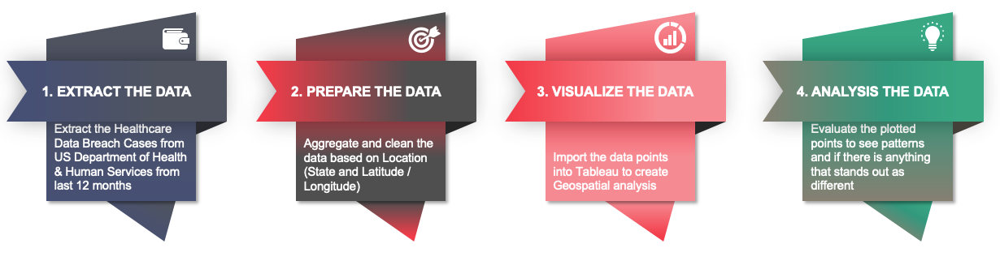
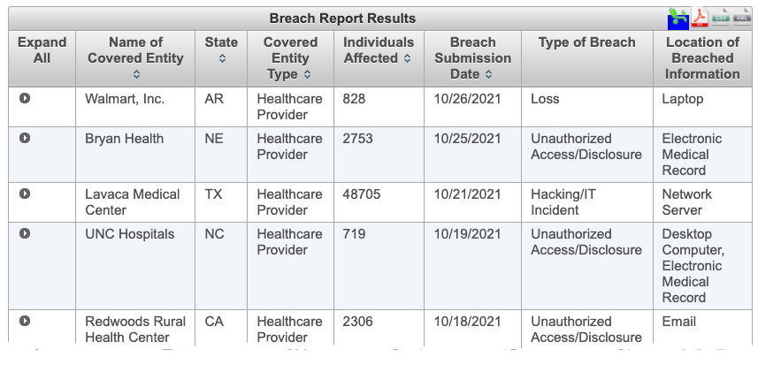
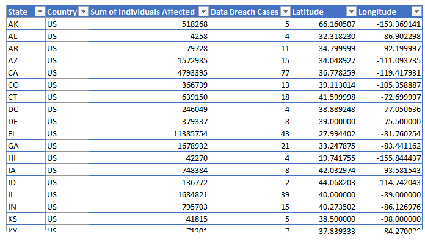
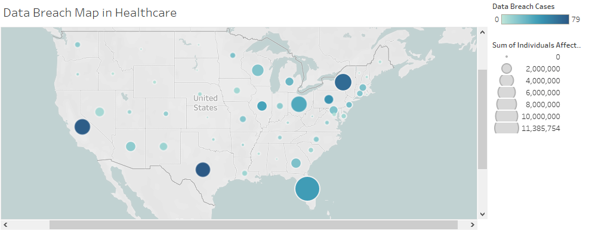
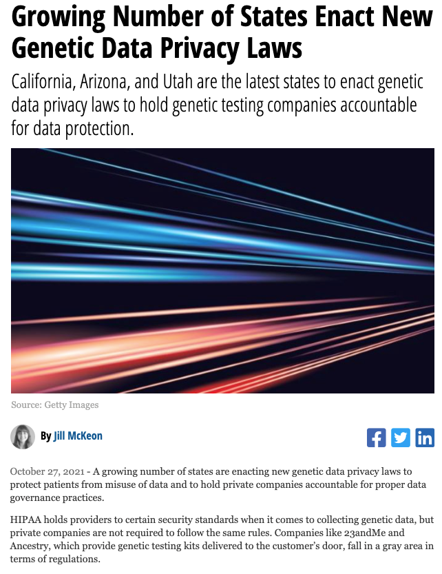

<FeatureCard
  title="Approach 4 - Geospatial Analysis of Data Breaches"
  color="dark"
  >

</FeatureCard>

Our team collected data about healthcare data breach cases in the last 12 months. The data includes information about the entity, individuals affected, type of breach and state. The goal was to plot this data visually to highlight any anomalies and patterns which will help the government and organizations focus its cyber resources.

Process:

***

First step, we *collected* the data breaches data from the [US HHS site](https://ocrportal.hhs.gov/ocr/breach/breach_report.jsf) and imported it in our data source database.

Second, we *prepared* the data for a Geospatial Analysis. As part of this process, we cleaned the data and grouped the cases per state, including latitude and longitude, count of data breach cases and sum of individuals affected.

***

The IP longitude/latitude data points for all data breach cases in the last 12 months were imported into the Tableau analytic tool. To create the map we used two dimensions, the sum of individuals affected (size of the bubble) and the count of data breach cases (color of the bubble).

***

### Insights gathered from this analytic:

1. Results show a national data breach trend (845 cases), in all states (including Alaska and Hawaii), only exception is South Dakota.
2. Some states (e.g.: FL and WI) have more big data breach cases impacting more individuals, other states have more cases in small organizations.
3. Increased number of cases during the COVID Pandemic (when compared with previous reports).
4. More than 72% of  cases were caused by hacking and IT incidents.
5. Map visualization tool helped us to easily visualize data distribution and made us ask questions and look for answers.
6. This visualization helped us to identify anomaly and patterns to define a cybersecurity strategies.
7. The map is a really good tool to create an executive dashboard (see slide 66) to help Government and Organizations define a cybersecurity plan, standard and laws (see examples below).

- [CA Attorney General Calls Out Unreported Healthcare Data Breaches - HealthITSecurity News](https://healthitsecurity.com/news/ca-attorney-general-calls-out-unreported-healthcare-data-breaches)

- [Growing Number of States Enact New Genetic Data Privacy Laws - HealthITSecurity News](https://healthitsecurity.com/news/growing-number-of-states-enact-new-genetic-data-privacy-laws)

