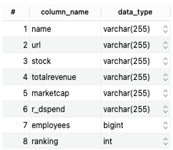

<FeatureCard
  title="Data Display 4 - Greenlight Guru"
  color="dark"
  >

</FeatureCard>

<AnchorLinks>
  <AnchorLink>Description</AnchorLink>
  <AnchorLink>Metadata</AnchorLink>
  <AnchorLink>Data</AnchorLink>

</AnchorLinks>

***

## Description
The organization ‘Greenlight Guru' provides quality management software for medical device manufactures.It helps to identify the different medical device manufactures which are used by the hospitals.

Number of Unique Records: 100

Date: Extracted from Greenligh Guru on October 3rd, 2021

***

## Metadata

***

## Data

|name|url|stock|totalrevenue|marketcap|r_dspend|employees|ranking|id|
| --- | --- | --- | --- | --- | --- | --- | --- | --- |
|Johnson & Johnson|http://www.jnj.com/|JNJ|$82.06B|$368.91B|$11.4B|132200|1|1|
|Novartis AG|https://www.novartis.com/|NVS|$49.49B|$199.09B|$8.1B|103941|2|2|
|Abbott Laboratories|http://www.abbott.com/|ABT|$30.6B|$143.91B|$2.3B|103000|3|3|
|Medtronic PLC|https://www.medtronic.com/|MDT|$30.56B|$137.53B|$2.33B|101000|4|4|
|Baxter International|https://www.baxter.com/|BAX|$11.1B|$129B|$655M|50000|5|5|
|Danaher Corporation|http://www.danaher.com/|DHR|$19.89B|$104.92B|$1.23B|71000|6|6|
|General Electric|https://www.ge.com/|GE|$95.21B|$97.98B|$4.16B|205000|7|7|
|3M Company|https://www.3m.com/|MMM|$32.8B|$87.99B|$1.8B|93516|8|8|
|Siemens Healthineers|https://www.healthcare.siemens.com/|SHL|€14.5B|$87.87B|€1.32B|52000|9|9|
|Stryker Corporation|http://www.stryker.com/|SYK|$13.6B|$73.87B|$856M|36000|10|10|
|Becton Dickinson & Company|http://www.bd.com/|BDX|$17.3B|$66.52B|$1.06B|70093|11|11|
|Intuitive Surgical Inc.|http://www.intuitivesurgical.com/|ISRG|$3.08B|$64.84B|$418M|5527|12|12|
|Allergan PLC|https://www.allergan.com/|AGN|$15.78B|$63.77B|$2.22B|16900|13|13|
|Hoya Corp|http://www.hoya.com/|7741|¥565.81B|¥3.49T|¥28B|34000|14|14|
|Boston Scientific Corp|http://www.bostonscientific.com/|BSX|$9.82B|$55.43B|$1.13B|32000|15|15|
|Edwards LifeSciences Corp|http://www.edwards.com/|EW|$3.8B|$44.53B|$646M|13000|16|16|
|Koninklijke Philips N.V.|https://www.philips.com/global|PHG|€19.5B|€38.63B|€1.76B|80495|17|17|
|Draegerwerk AG & Co KGaA|https://www.draeger.com/|ETR: DRW3|€2.59B|€30.16B|€780.75|1417|18|18|
|Coloplast A/S|https://www.coloplast.com/|CLPBF|$17.93B DKK|$29.29B USD|$692M DKK|11821|19|19|
|Zimmer Biomet Holdings|http://www.zimmerbiomet.com/|ZBH|$7.93B|$28.74B|$388M|19000|20|20|
|Fresenius Medical Care AG & Co. KGaA|https://fmcna.com/|FMS|€16.54B|€25.67B|€134M|112658|21|21|
|Olympus Corporation|http://www.olympus-global.com/|7733|¥793.9 B|$25.18B|¥84.70M|35124|22|22|
|Terumo Corporation|http://www.terumomedical.com/|4543|¥587.8B|$25.09B|¥41.34M|23319|23|23|
|ResMed Inc.|http://www.resmed.com/|RMD|$2.6B|$24.4B|$180.6M|7240|24|24|
|Smith & Nephew PLC|http://www.smith-nephew.com/|SNN|$4.9B|$20.21B|$246M|16000|25|25|
|Align Technology|http://www.aligntech.com/|ALGN|$1.9B|$18.13B|$128.9M|11660|26|26|
|The Cooper Companies Inc.|http://www.coopercos.com/|COO|$2.53B|$16.49B|$75M|12000|27|27|
|Teleflex Inc.|http://www.teleflex.com/|TFX|$2.44B|$16.39B|$106.20 |15200|28|28|
|Cardinal Health Inc.|https://www.cardinalhealth.com/|CAH|$145.5B|$15.76B|N/A|49500|29|29|
|Straumann Holding AG|https://www.straumann.com/|STMN.SW|CHF 1.59B|$15.09B|N/A|7590|30|30|
|Steris PLC|https://www.steris.com/|STE|$2.78B|$13.86B|$63.03M|12000|31|31|
|Hologic Inc.|http://www.hologic.com/|HOLX|$3.21B|$12.85B|$218.7M|6252|32|32|
|Waters Corporation|http://www.waters.com/|WAT|$2.41B|$12.6B|$143M|7200|33|33|
|West Pharmaceutical Services|https://www.westpharma.com/|WST|$1.72B|$11.55B|$40.3M|7700|34|34|
|Varian Medical Systems Inc.|http://www.varian.com/|VAR|$2.61B|$11.47B|$246M|10062|35|35|
|Dentsply Sirona Inc.|https://www.dentsplysirona.com/|XRAY|$3.98B|$11.04B|$160.5M|16400|36|36|
|Masimo Corporation|http://www.masimo.com/|MASI|$858M|$9.5B|$76.9M|1500|37|37|
|Sartorius Stedim Biotech S.A.|https://www.sartorius.com/|SUVPF|€1.93B|€6.87B|€95.6M|9016|38|38|
|Fisher & Paykel Healthcare Co. Ltd.|https://www.fphcare.com/|FPH|$1.07B NZD|$15.28B NZD|$428.2M NZD|4500|39|39|
|Cochlear Limited|https://www.cochlear.com/|COH|$1.24B AUD|$12B AUD|$184.4M AUD|4000|40|40|
|ABIOMED Inc.|http://www.abiomed.com/|ABMD|$769M|$6.99B|$94M|1350|41|41|
|Asahi Intecc Co. Ltd.|http://www.asahi-intecc.co.jp/|7747|¥50.12B|¥734.13B|¥12.3B|7810|42|42|
|Hill-Rom Holdings Inc.|http://www.hill-rom.com/|HRC|$2.91B|$6.74B|$139.5M|10000|43|43|
|Amplifon SpA|https://www.amplifon.com/|AMPPF|€1.37B|€5.465B|None|16000|44|44|
|Haemonetics Corporation|https://www.haemonetics.com/|HAE|$967M|$5.56B|$35.7M|3216|45|45|
|Shandong Weigao Group Medical Polymer|http://en.weigaogroup.com/|1066|¥8.8M|$5.02B|¥311.6M|9562|46|46|
|Insulet Corporation|http://www.insulet.com/|PODD|$738M|$4.92B|$129.7M|1350|47|47|
|Globus Medical Inc.|http://www.globusmedical.com/|GMED|$785.4M|$4.7B|$60M|1800|48|48|
|Getinge AB|https://www.getinge.com/|GNGBF|SEK 24.2B|$4.68B|SEK 1.25B|10515|49|49|
|Tandem Diabetes Care Inc.|https://www.tandemdiabetes.com/|TNDM|$183.9M|$4.64B|$8.7M|643|50|50|
