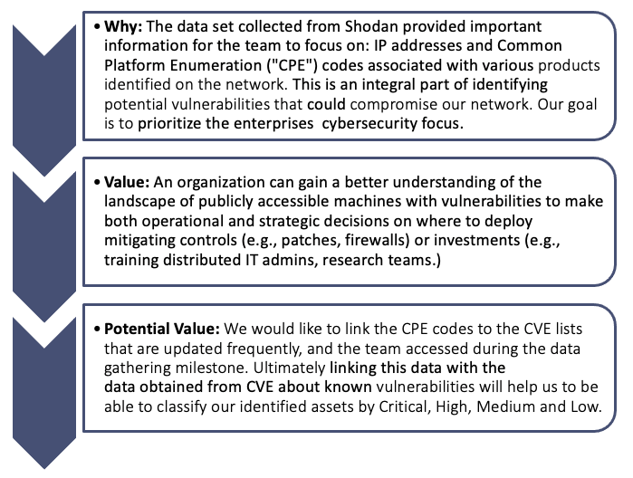
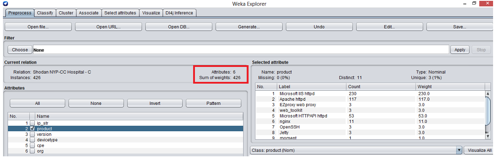
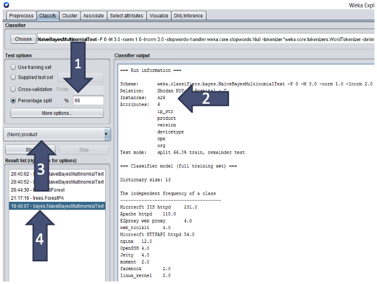
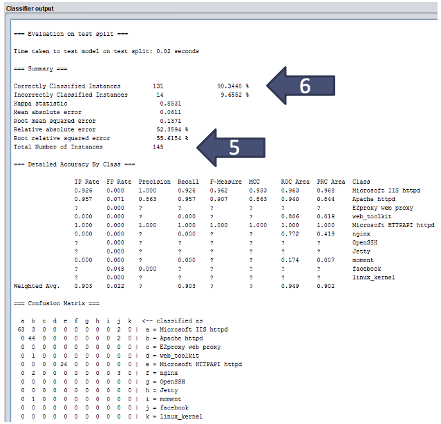
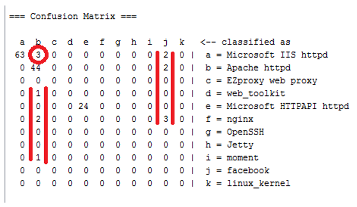
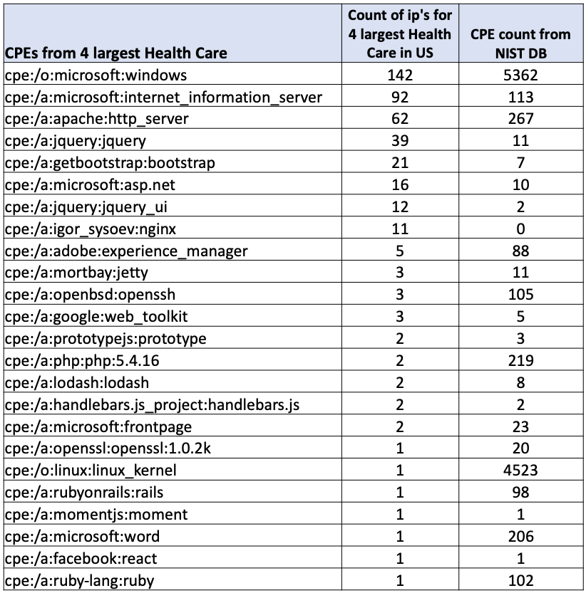
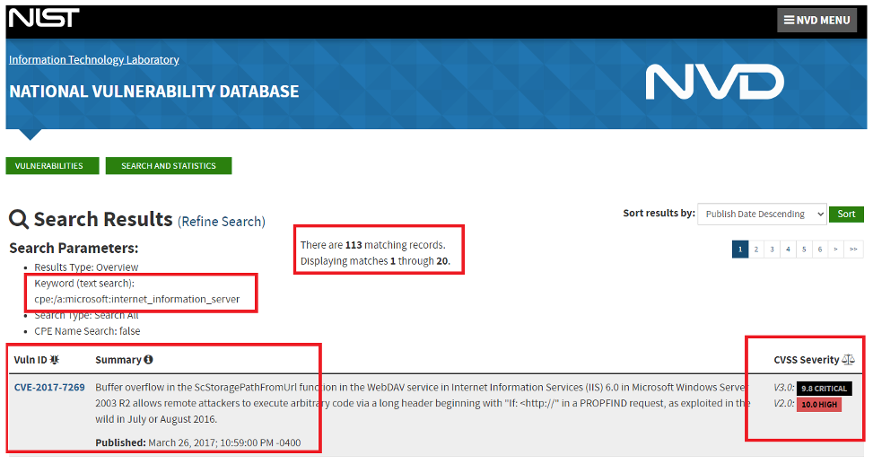

<FeatureCard
  title="Approach 1 - Classification of Shodan"
  color="dark"
  >

</FeatureCard>

***

Classification of devices from the top hospitals were obtained from Shodan, which we then classified by CPE code and product type.

**Data Sources Needed**:  The data is  extracted from Shodan using the API for the 4 major health care services.
 
**Analytics Process**:
1. Data obtained from Shodan API was stored in a mySQL table.
2. The table was queried to return all IP addresses, products, versions, device types, CPEs and org where the CPE field was not NULL.
3. The data was imported into WEKA and summarized using CPE and product attribute.
4. We utilized CPE data to understand the vulnerabilities for each of it.
5. We utilized the Naïve Bayes Algorithm as a classification method for product attribute.

***

The product attribute was selected on the WEKA platform, which is one of the attributes identified by Shodan that is associated with the various IP addresses for the top hospitals. This summary highlights that Microsoft IIS httpd was the most frequent protocol and had the most CPEs associated with it, therefore potentially exposing the network to more vulnerabilities.

Microsoft Internet Information Services (IIS) is a flexible, general-purpose web server that runs on Windows systems to serve requested HTML pages or files. An IIS web server accepts requests from remote client computers and returns appropriate response.

***

**Naive Bayes** is a classification algorithm that is suitable for binary and multiclass classification. It is a supervised classification technique used to classify future objects by assigning class labels to instances/records using conditional probability. It was determined that it would be important to classify the Shodan data by product/CPE. Since the data from product/CPE attributes contains labeled text data we have decided to use the Native Bayes algorithm. We would like to train an algorithm to properly classify this attribute.

***

**Steps Taken for the Algorithm**:
1. The data set was trained on 2/3 of the data and ran the test on the remaining 1/3 of the data. 
2. There were 426 instance in this data set.
3. The attribute that we want to classify is the product attribute.
4. Naive Bayes algorithm is used for Classification of the data.
5. 145 Records tested is 1/3 of the set (145/426)
6. This algorithm correctly classified the product attribute on this test data **90.34%** of the instances. See the next slide for details of the error.

***

The confusion matrix is showing the detail of the 145 test records and the ones which are highlighted in red are the errors.

14 times the algorithm code have failed, in which 3 times it wrongly captured Microsoft IIS httpd, instead of Apache httpd.

***

These are the different CPE’s which we have identified from Shodan from the top 4 hospitals CIDR’s. We were able to classify it with the most used CPE’s and count of vulnerabilities each of these CPE’s are having currently.

The NIST screenshot below shows the mostly used CPE  ‘cpe:/a:microsoft:internet_information_server’ for the product ‘Microsoft IIS httpd’ in Health Care industry.

