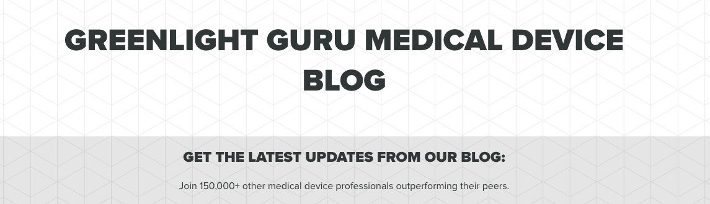
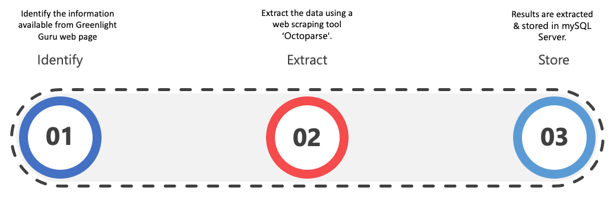

<FeatureCard
  title="Data Source 4 - Greenlight Guru"
  color="dark"
  >

</FeatureCard>

<AnchorLinks>
  <AnchorLink>Who generates the data?</AnchorLink>
  <AnchorLink>Is the data relevant?</AnchorLink>
  <AnchorLink>Is the data of high quality?</AnchorLink>
  <AnchorLink>Is the data accessible?</AnchorLink>
  <AnchorLink>Why did we select this data source and what value does it bring?</AnchorLink>
  <AnchorLink>What is the Collection Strategy?</AnchorLink>
</AnchorLinks>

***

## Who generates the data?

The organization ‘Greenlight Guru' provides quality management software for medical device manufactures.

***

## Is the data relevant?

It helps to identify the different medical device manufactures which are used by the hospitals.

***

## Is the data of high quality?

They provide the list of customers who are medical device manufactures.

***

## Is the data accessible?

The data is publicly accessible, and we are extracting it using a web scraping tool which captures the content of the page in a structured way.

***

## Why did we select this data source and what value does it bring?

This data source provides trustful medical device manufactures, which would be used to identify the different vulnerabilities.

***

## What is the Collection Strategy?

- Identify the information available from Greenlight Guru web pages.
- Extract the data using a web scraping tool ‘Octoparse'.
- Results are extracted & stored in mySQL Server.

