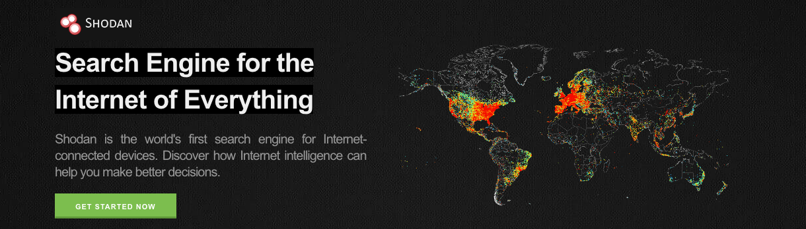

<FeatureCard
  title="Data Source 1 - Shodan"
  color="dark"
  >

</FeatureCard>

<AnchorLinks>
  <AnchorLink>Who generates the data?</AnchorLink>
  <AnchorLink>Is the data relevant?</AnchorLink>
  <AnchorLink>Is the data of high quality?</AnchorLink>
  <AnchorLink>Is the data accessible?</AnchorLink>
  <AnchorLink>Why did we select this data source and what value does it bring?</AnchorLink>
</AnchorLinks>

***

## Who generates the data?

Shodan is a search engine that searches for devices connected to the internet. It can be searched based on IP address, devices, city, etc.

***

## Is the data relevant?

Hospital CIDR's were provided in the search to identify all the relevant devices connected to the internet.  

***

## Is the data of high quality?

Shodan runs 24/7 and provides real time data. It “crawls” the Internet for publicly accessible devices, looking for specific IP addresses and hosts.

***

## Is the data accessible?

Shodan API provides access to all the data stored in Shodan and allows users to extract data in a usable format.

***

## Why did we select this data source and what value does it bring?

It provides list of hospital network devices which helps to narrow down the list of vulnerabilities relevant to those devices for further analysis. API feature allows us to collect, parse and store the data into MySQL database for easy analysis.

***

## What is the Collection Strategy?

- Identify the top US hospitals networking (CIDR).
- Extract all the hardware device information relevant to hospitals. Shodan API was used to extract the data from Shodan.
- Python to parse the JSON data and mySQL Server to store the data.

[collection strategy](images/shodan-collection-strategy.png)
