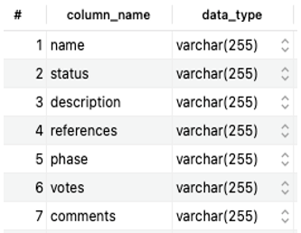

<FeatureCard
  title="Data Display 2 - MITRE-CVE"
  color="dark"
  >

</FeatureCard>

<AnchorLinks>
  <AnchorLink>Description</AnchorLink>
  <AnchorLink>Metadata</AnchorLink>
  <AnchorLink>Data</AnchorLink>

</AnchorLinks>

***

## Description

MITRE CVE is a platform that provides publicly known information security vulnerabilities and exposures data. Components utilized within hospitals (i.e., medical software & devices), can be suspectable to the vulnerabilities identified in the CVE list. Also, it helps to lookup the vulnerabilities by dates and provides released versions data and other helpful references.

Number of Unique Records: 215,615

Date: Extracted from MITRE CVE on October 3rd, 2021

***

## Metadata

***

## Data

| name | status |	description |	references | phase | votes	| comments |
| --- | --- | --- | --- | --- | --- | --- |
|CVE-2018-7700|Candidate|"DedeCMS 5.7 has CSRF with an impact of arbitrary code execution, because the partcode parameter in a tag_test_action.php request can specify a runphp field in conjunction with PHP code."|"MISC:https://laworigin.github.io/2018/03/07/CVE-2018-7700-dedecms%E5%90%8E%E5%8F%B0%E4%BB%BB%E6%84%8F%E4%BB%A3%E7%A0%81%E6%89%A7%E8%A1%8C/"|Assigned (20180305)|"None (candidate not yet proposed)"|""|
|CVE-2018-7701|Candidate|"Multiple cross-site request forgery (CSRF) vulnerabilities in SecurEnvoy SecurMail before 9.2.501 allow remote attackers to hijack the authentication of arbitrary users for requests that (1) delete e-mail messages via a delete action in a request to secmail/getmessage.exe or (2) spoof arbitrary users and reply to their messages via a request to secserver/securectrl.exe."|"EXPLOIT-DB:44285   -   URL:https://www.exploit-db.com/exploits/44285/   -   FULLDISC:20180312 SEC Consult SA-20180312-0 - Multiple Critical Vulnerabilities in SecurEnvoy SecurMail   -   URL:http://seclists.org/fulldisclosure/2018/Mar/29   -   MISC:https://www.sec-consult.com/en/blog/advisories/multiple-critical-vulnerabilities-in-securenvoy-securmail/index.html"|Assigned (20180305)|"None (candidate not yet proposed)”|””|
|CVE-2018-7702|Candidate|"SecurEnvoy SecurMail before 9.2.501 allows remote attackers to spoof transmission of arbitrary e-mail messages, resend e-mail messages to arbitrary recipients, or modify arbitrary message bodies and attachments by leveraging missing authentication and authorization."|"EXPLOIT-DB:44285   -   URL:https://www.exploit-db.com/exploits/44285/   -   FULLDISC:20180312 SEC Consult SA-20180312-0 :: Multiple Critical Vulnerabilities in SecurEnvoy SecurMail   -   URL:http://seclists.org/fulldisclosure/2018/Mar/29   -   MISC:https://www.sec-consult.com/en/blog/advisories/multiple-critical-vulnerabilities-in-securenvoy-securmail/index.html"|Assigned (20180305)|"None (candidate not yet proposed)”|””|
|CVE-2018-7703|Candidate|"Cross-site scripting (XSS) vulnerability in SecurEnvoy SecurMail before 9.2.501 allows remote attackers to inject arbitrary web script or HTML via the mailboxid parameter to secmail/getmessage.exe."|"EXPLOIT-DB:44285   -   URL:https://www.exploit-db.com/exploits/44285/   -   FULLDISC:20180312 SEC Consult SA-20180312-0 :: Multiple Critical Vulnerabilities in SecurEnvoy SecurMail   -   URL:http://seclists.org/fulldisclosure/2018/Mar/29   -   MISC:https://www.sec-consult.com/en/blog/advisories/multiple-critical-vulnerabilities-in-securenvoy-securmail/index.html"|Assigned (20180305)|"None (candidate not yet proposed)”|””|
|CVE-2018-7704|Candidate|"SecurEnvoy SecurMail before 9.2.501 allows remote authenticated users to read arbitrary e-mail messages via the option1 parameter in a reply action to secmail/getmessage.exe."|"EXPLOIT-DB:44285   -   URL:https://www.exploit-db.com/exploits/44285/   -   FULLDISC:20180312 SEC Consult SA-20180312-0 :: Multiple Critical Vulnerabilities in SecurEnvoy SecurMail   -   URL:http://seclists.org/fulldisclosure/2018/Mar/29   -   MISC:https://www.sec-consult.com/en/blog/advisories/multiple-critical-vulnerabilities-in-securenvoy-securmail/index.html"|Assigned (20180305)|"None (candidate not yet proposed)”|””|
|CVE-2018-7705|Candidate|"Directory traversal vulnerability in SecurEnvoy SecurMail before 9.2.501 allows remote authenticated users to read e-mail messages to arbitrary recipients via a .. (dot dot) in the filename parameter to secupload2/upload.aspx."|"EXPLOIT-DB:44285   -   URL:https://www.exploit-db.com/exploits/44285/   -   FULLDISC:20180312 SEC Consult SA-20180312-0 :: Multiple Critical Vulnerabilities in SecurEnvoy SecurMail   -   URL:http://seclists.org/fulldisclosure/2018/Mar/29   -   MISC:https://www.sec-consult.com/en/blog/advisories/multiple-critical-vulnerabilities-in-securenvoy-securmail/index.html"|Assigned (20180305)|"None (candidate not yet proposed)”|””|
|CVE-2018-7706|Candidate|"Directory traversal vulnerability in SecurEnvoy SecurMail before 9.2.501 allows remote authenticated users to read arbitrary e-mail messages via a .. (dot dot) in the option2 parameter in an attachment action to secmail/getmessage.exe."|"EXPLOIT-DB:44285   -   URL:https://www.exploit-db.com/exploits/44285/   -   FULLDISC:20180312 SEC Consult SA-20180312-0 :: Multiple Critical Vulnerabilities in SecurEnvoy SecurMail   -   URL:http://seclists.org/fulldisclosure/2018/Mar/29   -   MISC:https://www.sec-consult.com/en/blog/advisories/multiple-critical-vulnerabilities-in-securenvoy-securmail/index.html"|Assigned (20180305)|"None (candidate not yet proposed)"|""|
|CVE-2018-7707|Candidate|"Cross-site scripting (XSS) vulnerability in SecurEnvoy SecurMail before 9.2.501 allows remote attackers to inject arbitrary web script or HTML via an HTML-formatted e-mail message."|"EXPLOIT-DB:44285   -   URL:https://www.exploit-db.com/exploits/44285/   -   FULLDISC:20180312 SEC Consult SA-20180312-0 :: Multiple Critical Vulnerabilities in SecurEnvoy SecurMail   -   URL:http://seclists.org/fulldisclosure/2018/Mar/29   -   MISC:https://www.sec-consult.com/en/blog/advisories/multiple-critical-vulnerabilities-in-securenvoy-securmail/index.html"|Assigned (20180305)|"None (candidate not yet proposed)"|""|
|CVE-2018-7708|Candidate|"** RESERVED ** This candidate has been reserved by an organization or individual that will use it when announcing a new security problem.  When the candidate has been publicized, the details for this candidate will be provided."|""|Assigned (20180305)|"None (candidate not yet proposed)"|""|
|CVE-2018-7709|Candidate|"** RESERVED ** This candidate has been reserved by an organization or individual that will use it when announcing a new security problem.  When the candidate has been publicized, the details for this candidate will be provided."|""|Assigned (20180305)|"None (candidate not yet proposed)"|""|
|CVE-2018-7710|Candidate|"** RESERVED ** This candidate has been reserved by an organization or individual that will use it when announcing a new security problem.  When the candidate has been publicized, the details for this candidate will be provided."|""|Assigned (20180305)|"None (candidate not yet proposed)”|””|
|CVE-2018-7711|Candidate|"HTTPRedirect.php in the saml2 library in SimpleSAMLphp before 1.15.4 has an incorrect check of return values in the signature validation utilities, allowing an attacker to get invalid signatures accepted as valid by forcing an error during validation. This occurs because of a dependency on PHP functionality that interprets a -1 error code as a true boolean value."|"CONFIRM:https://github.com/simplesamlphp/saml2/commit/4f6af7f69f29df8555a18b9bb7b646906b45924d   -   CONFIRM:https://simplesamlphp.org/security/201803-01   -   MLIST:[debian-lts-announce] 20180323 [SECURITY] [DLA 1314-1] simplesamlphp security update   -   URL:https://lists.debian.org/debian-lts-announce/2018/03/msg00017.html"|Assigned (20180305)|"None (candidate not yet proposed)"|""|
|CVE-2018-7712|Candidate|"** DISPUTED ** The validateInputImageSize function in modules/imgcodecs/src/loadsave.cpp in OpenCV 3.4.1 allows remote attackers to cause a denial of service (assertion failure) because (size.height <= (1<<20)) may be false. Note: &#8220;OpenCV CV_Assert is not an assertion (C-like assert()), it is regular C++ exception which can raised in case of invalid or non-supported parameters.&#8221;"|"MISC:https://github.com/opencv/opencv/issues/10998   -   MISC:https://github.com/xiaoqx/pocs/tree/master/opencv/dos-by-assert"|Assigned (20180305)|"None (candidate not yet proposed)"|""|
|CVE-2018-7713|Candidate|"** DISPUTED ** The validateInputImageSize function in modules/imgcodecs/src/loadsave.cpp in OpenCV 3.4.1 allows remote attackers to cause a denial of service (assertion failure) because (size.width <= (1<<20)) may be false. Note: &#8220;OpenCV CV_Assert is not an assertion (C-like assert()), it is regular C++ exception which can raised in case of invalid or non-supported parameters.&#8221;"|"MISC:https://github.com/opencv/opencv/issues/10998   -   MISC:https://github.com/xiaoqx/pocs/tree/master/opencv/dos-by-assert"|Assigned (20180305)|"None (candidate not yet proposed)"|""|
|CVE-2018-7714|Candidate|"** DISPUTED ** The validateInputImageSize function in modules/imgcodecs/src/loadsave.cpp in OpenCV 3.4.1 allows remote attackers to cause a denial of service (assertion failure) because (pixels <= (1<<30)) may be false. Note: &#8220;OpenCV CV_Assert is not an assertion (C-like assert()), it is regular C++ exception which can raised in case of invalid or non-supported parameters.&#8221;"|"MISC:https://github.com/opencv/opencv/issues/10998   -   MISC:https://github.com/xiaoqx/pocs/tree/master/opencv/dos-by-assert"|Assigned (20180305)|"None (candidate not yet proposed)"|""|
|CVE-2018-7715|Candidate|"PrivateVPN 2.0.31 for macOS suffers from a root privilege escalation vulnerability with its com.privat.vpn.helper privileged helper tool. This privileged helper tool implements an XPC service that allows arbitrary installed applications to connect and send messages. The XPC service extracts the path string from the corresponding XPC message. This string is supposed to point to PrivateVPN's internal openvpn binary. If a new connection has not already been established, an attacker can send the XPC service a malicious XPC message with the path string pointing at a binary that he or she controls. This results in the execution of arbitrary code as the root user."|"MISC:https://github.com/VerSprite/research/blob/master/advisories/VS-2018-005.md"|Assigned (20180305)|"None (candidate not yet proposed)"|""|
|CVE-2018-7716|Candidate|"PrivateVPN 2.0.31 for macOS suffers from a root privilege escalation vulnerability with its com.privat.vpn.helper privileged helper tool. This privileged helper tool implements an XPC service that allows arbitrary installed applications to connect and send messages. The XPC service extracts the config string from the corresponding XPC message. This string is supposed to point to an internal OpenVPN configuration file. If a new connection has not already been established, an attacker can send the XPC service a malicious XPC message with the config string pointing at an OpenVPN configuration file that he or she controls. In the configuration file, an attacker can specify a dynamic library plugin that should run for every new VPN connection. This plugin will execute code in the context of the root user."|"MISC:https://github.com/VerSprite/research/edit/master/advisories/VS-2018-006.md"|Assigned (20180305)|"None (candidate not yet proposed)"|""|
|CVE-2018-7717|Candidate|"The htmlImageAddTitleAttribute function in sige.php in the Kubik-Rubik Simple Image Gallery Extended (SIGE) extension 3.2.3 for Joomla! has XSS via a crafted image header, as demonstrated by the Caption-Abstract header object in a JPEG file. This is fixed in 3.3.1."|"MISC:http://debugtrap.com/2018/03/01/joomla_sige_xss/"|Assigned (20180305)|"None (candidate not yet proposed)"|""|
|CVE-2018-7718|Candidate|"An issue was discovered in Telexy QPath 5.4.462. A low privileged authenticated user supplying a specially crafted serialized request to AdanitDataService.svc may modify user information, including but not limited to email address, username, and password, of other user accounts. The simplest attack approach is for the attacker to intercept their own password-change request and modify the username before the request reaches the server. Also, changing a victim's email address can have a similar account-takeover consequence."|"MISC:https://www.dropbox.com/s/6tlee2uj3t3su8n/Telexy-QPath-CVE-2018-7718.pdf"|Assigned (20180305)|"None (candidate not yet proposed)"|""|
|CVE-2018-7719|Candidate|"Acrolinx Server before 5.2.5 on Windows allows Directory Traversal."|"CONFIRM:https://support.acrolinx.com/hc/en-us/articles/213987685-Acrolinx-Server-Version-5-1-including-subsequent-service-releases-   -   EXPLOIT-DB:44345   -   URL:https://www.exploit-db.com/exploits/44345/"|Assigned (20180306)|"None (candidate not yet proposed)"|""|
|CVE-2018-7720|Candidate|"A cross-site request forgery (CSRF) vulnerability exists in Western Bridge Cobub Razor 0.7.2 via /index.php?/user/createNewUser/, resulting in account creation."|"MISC:https://github.com/Kyhvedn/CVE_Description/blob/master/CVE-2018-7720_Description.md"|Assigned (20180306)|"None (candidate not yet proposed)”|””|
|CVE-2018-7721|Candidate|"Cross Site Scripting (XSS) exists in MetInfo 6.0.0 via /feedback/index.php because app/system/feedback/web/feedback.class.php mishandles input data."|"MISC:https://github.com/Gitaddy/vluns/blob/master/Metinfo.md"|Assigned (20180306)|"None (candidate not yet proposed)"|""|
|CVE-2018-7722|Candidate|"The management panel in Piwigo 2.9.3 has stored XSS via the name parameter in a /ws.php?format=json request. CSRF exploitation, related to CVE-2017-10681, may be possible."|"MISC:https://github.com/summ3rf/Vulner/blob/master/Piwigo%20Store%20XSS.md"|Assigned (20180306)|"None (candidate not yet proposed)"|""|
|CVE-2018-7723|Candidate|"The management panel in Piwigo 2.9.3 has stored XSS via the virtual_name parameter in a /admin.php?page=cat_list request, a different issue than CVE-2017-9836. CSRF exploitation, related to CVE-2017-10681, may be possible."|"MISC:https://github.com/summ3rf/Vulner/blob/master/Piwigo%20Store%20XSS.md"|Assigned (20180306)|"None (candidate not yet proposed)"|""|
|CVE-2018-7724|Candidate|"The management panel in Piwigo 2.9.3 has stored XSS via the name parameter in a /admin.php?page=photo-${photo_number} request. CSRF exploitation, related to CVE-2017-10681, may be possible."|"MISC:https://github.com/summ3rf/Vulner/blob/master/Piwigo%20Store%20XSS.md"|Assigned (20180306)|"None (candidate not yet proposed)"|""|
|CVE-2018-7725|Candidate|"An issue was discovered in ZZIPlib 0.13.68. An invalid memory address dereference was discovered in zzip_disk_fread in mmapped.c. The vulnerability causes an application crash, which leads to denial of service."|"MISC:https://github.com/gdraheim/zziplib/issues/39   -   MLIST:[debian-lts-announce] 20200628 [SECURITY] [DLA 2258-1] zziplib security update   -   URL:https://lists.debian.org/debian-lts-announce/2020/06/msg00029.html   -   REDHAT:RHSA-2018:3229   -   URL:https://access.redhat.com/errata/RHSA-2018:3229   -   UBUNTU:USN-3699-1   -   URL:https://usn.ubuntu.com/3699-1/"|Assigned (20180306)|"None (candidate not yet proposed)"|""|
|CVE-2018-7726|Candidate|"An issue was discovered in ZZIPlib 0.13.68. There is a bus error caused by the __zzip_parse_root_directory function of zip.c. Attackers could leverage this vulnerability to cause a denial of service via a crafted zip file."|"MISC:https://github.com/gdraheim/zziplib/issues/41   -   MLIST:[debian-lts-announce] 20200628 [SECURITY] [DLA 2258-1] zziplib security update   -   URL:https://lists.debian.org/debian-lts-announce/2020/06/msg00029.html   -   REDHAT:RHSA-2018:3229   -   URL:https://access.redhat.com/errata/RHSA-2018:3229   -   UBUNTU:USN-3699-1   -   URL:https://usn.ubuntu.com/3699-1/"|Assigned (20180306)|"None (candidate not yet proposed)"|""|
|CVE-2018-7727|Candidate|"An issue was discovered in ZZIPlib 0.13.68. There is a memory leak triggered in the function zzip_mem_disk_new in memdisk.c, which will lead to a denial of service attack."|"MISC:https://github.com/gdraheim/zziplib/issues/40   -   REDHAT:RHSA-2018:3229   -   URL:https://access.redhat.com/errata/RHSA-2018:3229"|Assigned (20180306)|"None (candidate not yet proposed)"|""|
|CVE-2018-7728|Candidate|"An issue was discovered in Exempi through 2.4.4. XMPFiles/source/FileHandlers/TIFF_Handler.cpp mishandles a case of a zero length, leading to a heap-based buffer over-read in the MD5Update() function in third-party/zuid/interfaces/MD5.cpp."|"FEDORA:FEDORA-2020-e22e9a655d   -   URL:https://lists.fedoraproject.org/archives/list/package-announce@lists.fedoraproject.org/message/BCFXKOOATZ2B5G3G7EBXZWVZHEABN4ZV/   -   MISC:https://bugs.freedesktop.org/show_bug.cgi?id=105205   -   MISC:https://cgit.freedesktop.org/exempi/commit/?id=e163667a06a9b656a047b0ec660b871f29a83c9f   -   MLIST:[debian-lts-announce] 20180321 [SECURITY] [DLA 1310-1] exempi security update   -   URL:https://lists.debian.org/debian-lts-announce/2018/03/msg00013.html   -   UBUNTU:USN-3668-1   -   URL:https://usn.ubuntu.com/3668-1/"|Assigned (20180306)|"None (candidate not yet proposed)"|""|
|CVE-2018-7729|Candidate|"An issue was discovered in Exempi through 2.4.4. There is a stack-based buffer over-read in the PostScript_MetaHandler::ParsePSFile() function in XMPFiles/source/FileHandlers/PostScript_Handler.cpp."|"FEDORA:FEDORA-2020-e22e9a655d   -   URL:https://lists.fedoraproject.org/archives/list/package-announce@lists.fedoraproject.org/message/BCFXKOOATZ2B5G3G7EBXZWVZHEABN4ZV/   -   MISC:https://bugs.freedesktop.org/show_bug.cgi?id=105206   -   MISC:https://cgit.freedesktop.org/exempi/commit/?id=baa4b8a02c1ffab9645d13f0bfb1c0d10d311a0c   -   UBUNTU:USN-3668-1   -   URL:https://usn.ubuntu.com/3668-1/"|Assigned (20180306)|"None (candidate not yet proposed)"|""|
|CVE-2018-7730|Candidate|"An issue was discovered in Exempi through 2.4.4. A certain case of a 0xffffffff length is mishandled in XMPFiles/source/FormatSupport/PSIR_FileWriter.cpp, leading to a heap-based buffer over-read in the PSD_MetaHandler::CacheFileData() function."|"FEDORA:FEDORA-2020-e22e9a655d   -   URL:https://lists.fedoraproject.org/archives/list/package-announce@lists.fedoraproject.org/message/BCFXKOOATZ2B5G3G7EBXZWVZHEABN4ZV/   -   MISC:https://bugs.freedesktop.org/show_bug.cgi?id=105204   -   MISC:https://cgit.freedesktop.org/exempi/commit/?id=6cbd34025e5fd3ba47b29b602096e456507ce83b   -   MLIST:[debian-lts-announce] 20180321 [SECURITY] [DLA 1310-1] exempi security update   -   URL:https://lists.debian.org/debian-lts-announce/2018/03/msg00013.html   -   REDHAT:RHSA-2019:2048   -   URL:https://access.redhat.com/errata/RHSA-2019:2048   -   UBUNTU:USN-3668-1   -   URL:https://usn.ubuntu.com/3668-1/"|Assigned (20180306)|"None (candidate not yet proposed)"|""|
|CVE-2018-7731|Candidate|"An issue was discovered in Exempi through 2.4.4. XMPFiles/source/FormatSupport/WEBP_Support.cpp does not check whether a bitstream has a NULL value, leading to a NULL pointer dereference in the WEBP::VP8XChunk class."|"FEDORA:FEDORA-2020-e22e9a655d   -   URL:https://lists.fedoraproject.org/archives/list/package-announce@lists.fedoraproject.org/message/BCFXKOOATZ2B5G3G7EBXZWVZHEABN4ZV/   -   MISC:https://bugs.freedesktop.org/show_bug.cgi?id=105247   -   MISC:https://cgit.freedesktop.org/exempi/commit/?id=aabedb5e749dd59112a3fe1e8e08f2d934f56666   -   UBUNTU:USN-3668-1   -   URL:https://usn.ubuntu.com/3668-1/"|Assigned (20180306)|"None (candidate not yet proposed)"|""|
|CVE-2018-7732|Candidate|"An issue was discovered in YxtCMF 3.1. SQL Injection exists in ShitiController.class.php via the ids array parameter to exam/shiti/delshiti.html."|"MISC:https://github.com/SQYY/CVE/blob/master/YxtCMF_S.txt"|Assigned (20180306)|"None (candidate not yet proposed)"|""|
|CVE-2018-7733|Candidate|"An issue was discovered in YxtCMF 3.1. RbacController.class.php has CSRF, as demonstrated by modifying an administrator account via index.php/admin/user/add_post.html."|"MISC:https://github.com/SQYY/CVE/blob/master/YxtCMF_C"|Assigned (20180306)|"None (candidate not yet proposed)"|""|
|CVE-2018-7734|Candidate|"Afian FileRun (before 2018.02.13) suffers from a remote SQL injection vulnerability, when logged in as superuser, via the search parameter in a /?module=users&section=cpanel&page=list request."|"MISC:http://www.filerun.com/changelog   -   MISC:https://feedback.filerun.com/communities/1/topics/189-critical-security-update-available   -   MISC:https://www.scanfsec.com/FileRun_2017_09_25_Blind_SQL.html"|Assigned (20180306)|"None (candidate not yet proposed)"|""|
|CVE-2018-7735|Candidate|"Afian FileRun (before 2018.02.13) suffers from a remote SQL injection vulnerability, when logged in as superuser, via the search parameter in a /?module=metadata&section=cpanel&page=list_filetypes request."|"MISC:http://www.filerun.com/changelog   -   MISC:https://feedback.filerun.com/communities/1/topics/189-critical-security-update-available   -   MISC:https://www.scanfsec.com/FileRun_2017_09_25_Blind_SQL.html"|Assigned (20180306)|"None (candidate not yet proposed)"|""|
|CVE-2018-7736|Candidate|"** DISPUTED ** In Z-BlogPHP 1.5.1.1740, cmd.php has XSS via the ZC_BLOG_SUBNAME parameter or ZC_UPLOAD_FILETYPE parameter. NOTE: the software maintainer disputes that this is a vulnerability."|"CONFIRM:https://github.com/zblogcn/zblogphp/issues/205   -   EXPLOIT-DB:44406   -   URL:https://www.exploit-db.com/exploits/44406/   -   MISC:https://github.com/ponyma233/cms/blob/master/Z-Blog_1.5.1.1740_bugs.md   -   MISC:https://packetstormsecurity.com/files/147066/Z-Blog-1.5.1.1740-Cross-Site-Scripting.html"|Assigned (20180306)|"None (candidate not yet proposed)"|""|
|CVE-2018-7737|Candidate|"** DISPUTED ** In Z-BlogPHP 1.5.1.1740, there is Web Site physical path leakage, as demonstrated by admin_footer.php or admin_footer.php. NOTE: the software maintainer disputes that this is a vulnerability."|"CONFIRM:https://github.com/zblogcn/zblogphp/issues/205   -   EXPLOIT-DB:44407   -   URL:https://www.exploit-db.com/exploits/44407/   -   MISC:https://github.com/ponyma233/cms/blob/master/Z-Blog_1.5.1.1740_bugs.md#web-site-physical-path-leakage   -   MISC:https://packetstormsecurity.com/files/147063/Z-Blog-1.5.1.1740-Full-Path-Disclosure.html"|Assigned (20180306)|"None (candidate not yet proposed)"|""|
|CVE-2018-7738|Candidate|"In util-linux before 2.32-rc1, bash-completion/umount allows local users to gain privileges by embedding shell commands in a mountpoint name, which is mishandled during a umount command (within Bash) by a different user, as demonstrated by logging in as root and entering umount followed by a tab character for autocompletion."|"BID:103367   -   URL:http://www.securityfocus.com/bid/103367   -   DEBIAN:DSA-4134   -   URL:https://www.debian.org/security/2018/dsa-4134   -   MISC:https://bugs.debian.org/892179   -   MISC:https://github.com/karelzak/util-linux/commit/75f03badd7ed9f1dd951863d75e756883d3acc55   -   MISC:https://github.com/karelzak/util-linux/issues/539   -   UBUNTU:USN-4512-1   -   URL:https://usn.ubuntu.com/4512-1/"|Assigned (20180306)|"None (candidate not yet proposed)"|""|
|CVE-2018-7739|Candidate|"antsle antman before 0.9.1a allows remote attackers to bypass authentication via invalid characters in the username and password parameters, as demonstrated by a username=>&password=%0a string to the /login URI. This allows obtaining root permissions within the web management console, because the login process uses Java's ProcessBuilder class and a bash script called antsle-auth with insufficient input validation."|"EXPLOIT-DB:44220   -   URL:https://www.exploit-db.com/exploits/44220/   -   EXPLOIT-DB:44262   -   URL:https://www.exploit-db.com/exploits/44262/   -   MISC:http://blog.codecatoctin.com/2018/02/antman-authentication-bypass.html"|Assigned (20180306)|"None (candidate not yet proposed)"|""|
|CVE-2018-7740|Candidate|"The resv_map_release function in mm/hugetlb.c in the Linux kernel through 4.15.7 allows local users to cause a denial of service (BUG) via a crafted application that makes mmap system calls and has a large pgoff argument to the remap_file_pages system call."|"BID:103316   -   URL:http://www.securityfocus.com/bid/103316   -   CONFIRM:https://bugzilla.kernel.org/show_bug.cgi?id=199037   -   DEBIAN:DSA-4187   -   URL:https://www.debian.org/security/2018/dsa-4187   -   DEBIAN:DSA-4188   -   URL:https://www.debian.org/security/2018/dsa-4188   -   MLIST:[debian-lts-announce] 20180502 [SECURITY] [DLA 1369-1] linux security update   -   URL:https://lists.debian.org/debian-lts-announce/2018/05/msg00000.html   -   REDHAT:RHSA-2018:3083   -   URL:https://access.redhat.com/errata/RHSA-2018:3083   -   REDHAT:RHSA-2018:3096   -   URL:https://access.redhat.com/errata/RHSA-2018:3096   -   UBUNTU:USN-3910-1   -   URL:https://usn.ubuntu.com/3910-1/   -   UBUNTU:USN-3910-2   -   URL:https://usn.ubuntu.com/3910-2/"|Assigned (20180307)|"None (candidate not yet proposed)"|""|
|CVE-2018-7741|Candidate|"Eramba e1.0.6.033 has Reflected XSS in the Date Filter via the created parameter to the /crons URI."|"MISC:https://medium.com/stolabs/security-issues-on-eramba-cf887bc0a069"|Assigned (20180307)|"None (candidate not yet proposed)"|""|
|CVE-2018-7742|Candidate|"** RESERVED ** This candidate has been reserved by an organization or individual that will use it when announcing a new security problem.  When the candidate has been publicized, the details for this candidate will be provided."|""|Assigned (20180307)|"None (candidate not yet proposed)"|""|
|CVE-2018-7743|Candidate|"** RESERVED ** This candidate has been reserved by an organization or individual that will use it when announcing a new security problem.  When the candidate has been publicized, the details for this candidate will be provided."|""|Assigned (20180307)|"None (candidate not yet proposed)"|""|
|CVE-2018-7744|Candidate|"** RESERVED ** This candidate has been reserved by an organization or individual that will use it when announcing a new security problem.  When the candidate has been publicized, the details for this candidate will be provided."|""|Assigned (20180307)|"None (candidate not yet proposed)"|""|
|CVE-2018-7745|Candidate|"An issue was discovered in Western Bridge Cobub Razor 0.7.2. Authentication is not required for /index.php?/install/installation/createuserinfo requests, resulting in account creation."|"EXPLOIT-DB:44419   -   URL:https://www.exploit-db.com/exploits/44419/   -   MISC:https://github.com/cobub/razor/issues/161"|Assigned (20180307)|"None (candidate not yet proposed)"|""|
|CVE-2018-7746|Candidate|"An issue was discovered in Western Bridge Cobub Razor 0.7.2. Authentication is not required for /index.php?/manage/channel/modifychannel. For example, with a crafted channel name, stored XSS is triggered during a later /index.php?/manage/channel request by an admin."|"EXPLOIT-DB:44416   -   URL:https://www.exploit-db.com/exploits/44416/   -   MISC:https://github.com/cobub/razor/issues/161"|Assigned (20180307)|"None (candidate not yet proposed)"|""
|CVE-2018-7747|Candidate|"Multiple cross-site scripting (XSS) vulnerabilities in the Caldera Forms plugin before 1.6.0-rc.1 for WordPress allow remote attackers to inject arbitrary web script or HTML via vectors involving (1) a greeting message, (2) the email transaction log, or (3) an imported form."|"CONFIRM:https://calderaforms.com/2018/03/caldera-forms-1-6-is-here/   -   CONFIRM:https://calderaforms.com/updates/caldera-forms-1-6-0/#security   -   CONFIRM:https://wordpress.org/plugins/caldera-forms/#developers   -   EXPLOIT-DB:44489   -   URL:https://www.exploit-db.com/exploits/44489/   -   MISC:http://packetstormsecurity.com/files/147257/WordPress-Caldera-Forms-1.5.9.1-Cross-Site-Scripting.html"|Assigned (20180307)|"None (candidate not yet proposed)"|""|
|CVE-2018-7748|Candidate|"report_viewer.do in ServiceNow Release Jakarta Patch 8 and earlier allows remote attackers to execute arbitrary code via '${xyz}' Glide Scripting Injection in the sysparm_media parameter."|"MISC:https://telekomsecurity.github.io/2018/07/servicenow-privilege-escalation.html   -   MISC:https://telekomsecurity.github.io/assets/advisories/20180104_ServiceNow_GlideInjection.txt"|Assigned (20180307)|"None (candidate not yet proposed)"|""
|CVE-2018-7749|Candidate|"The SSH server implementation of AsyncSSH before 1.12.1 does not properly check whether authentication is completed before processing other requests. A customized SSH client can simply skip the authentication step."|"CONFIRM:https://github.com/ronf/asyncssh/commit/c161e26cdc0d41b745b63d9f17b437f073bf7ba4   -   MLIST:[asyncssh-announce] 20180310  AsyncSSH 1.12.1 released, with important security fix!   -   URL:https://groups.google.com/forum/#!msg/asyncssh-announce/57_5O7kiHSA/8BXZ_hxHAQAJ"|Assigned (20180307)|"None (candidate not yet proposed)"|""|
|CVE-2018-7750|Candidate|"transport.py in the SSH server implementation of Paramiko before 1.17.6, 1.18.x before 1.18.5, 2.0.x before 2.0.8, 2.1.x before 2.1.5, 2.2.x before 2.2.3, 2.3.x before 2.3.2, and 2.4.x before 2.4.1 does not properly check whether authentication is completed before processing other requests, as demonstrated by channel-open. A customized SSH client can simply skip the authentication step."|"BID:103713   -   URL:http://www.securityfocus.com/bid/103713   -   CONFIRM:https://github.com/paramiko/paramiko/blob/master/sites/www/changelog.rst   -   CONFIRM:https://github.com/paramiko/paramiko/commit/fa29bd8446c8eab237f5187d28787727b4610516   -   CONFIRM:https://github.com/paramiko/paramiko/issues/1175   -   EXPLOIT-DB:45712   -   URL:https://www.exploit-db.com/exploits/45712/   -   MLIST:[debian-lts-announce] 20181027 [SECURITY] [DLA 1556-1] paramiko security update   -   URL:https://lists.debian.org/debian-lts-announce/2018/10/msg00018.html   -   REDHAT:RHSA-2018:0591   -   URL:https://access.redhat.com/errata/RHSA-2018:0591   -   REDHAT:RHSA-2018:0646   -   URL:https://access.redhat.com/errata/RHSA-2018:0646   -   REDHAT:RHSA-2018:1124   -   URL:https://access.redhat.com/errata/RHSA-2018:1124   -   REDHAT:RHSA-2018:1125   -   URL:https://access.redhat.com/errata/RHSA-2018:1125   -   REDHAT:RHSA-2018:1213   -   URL:https://access.redhat.com/errata/RHSA-2018:1213   -   REDHAT:RHSA-2018:1274   -   URL:https://access.redhat.com/errata/RHSA-2018:1274   -   REDHAT:RHSA-2018:1328   -   URL:https://access.redhat.com/errata/RHSA-2018:1328   -   REDHAT:RHSA-2018:1525   -   URL:https://access.redhat.com/errata/RHSA-2018:1525   -   REDHAT:RHSA-2018:1972   -   URL:https://access.redhat.com/errata/RHSA-2018:1972   -   UBUNTU:USN-3603-1   -   URL:https://usn.ubuntu.com/3603-1/   -   UBUNTU:USN-3603-2   -   URL:https://usn.ubuntu.com/3603-2/"|Assigned (20180307)|"None (candidate not yet proposed)"|""|
