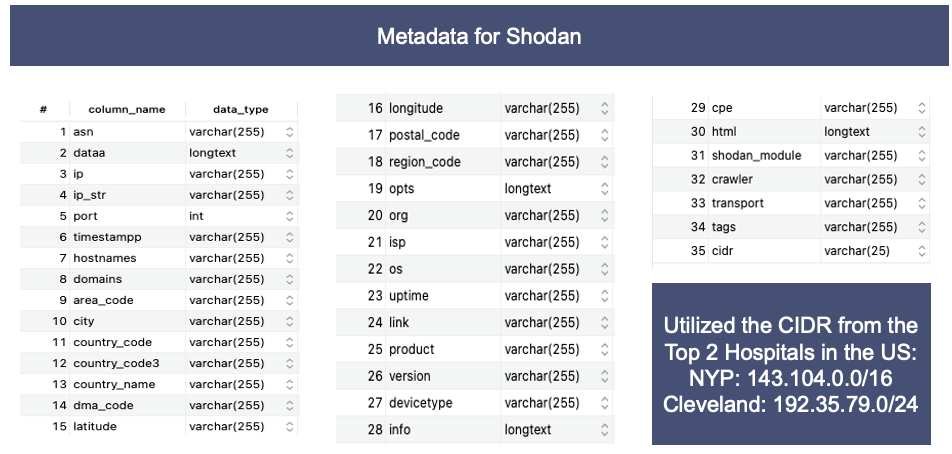

<FeatureCard
  title="Data Display 1 - Shodan"
  color="dark"
  >

</FeatureCard>

<AnchorLinks>
  <AnchorLink>Description</AnchorLink>
  <AnchorLink>Metadata</AnchorLink>
  <AnchorLink>Data</AnchorLink>

</AnchorLinks>

***

## Description

We utilized the CIDR search on Shodan to collect a list of connected devices from top 2 hospitals in US: New York-Presbyterian (CIDR - 143.104.0.0/16) and Cleveland Clinic (CIDR - 192.35.79.0/24)

Number of Unique Records: 421

Date: Extracted from Shodan on October 3rd, 2021

***

## Metadata

***

## Data

| asn | dataa | ip | ip_str | port | timestampp | hostnames | domains | area_code | city | country_code | country_code3 | country_name | dma_code | latitude | longitude | postal_code | region_code | opts | org | isp | os | uptime | link | product | version | devicetype | info | cpe | html | shodan_module | crawler | transport | tags | cidr |
| --- | --- | --- | --- | --- | --- | --- | --- | --- | --- | --- | --- | --- | --- | --- | --- | --- | --- | --- | --- | --- | --- | --- | --- | --- | --- | --- | --- | --- | --- | --- | --- | --- | --- | --- |
| AS395139 |	"HTTP/1.0 302 Temporary moved | 2405957934 | 143.104.1.46 | 80 | 2021-09-28T22:47:58.682083 |  |  |  | New York City | US |  | United States |  | 40.71427 | -74.00597 | | NY | | NewYork-Presbyterian Hospital | NewYork-Presbyterian Hospital |	NULL | NULL	| NULL	| NULL	| NULL	| NULL	| NULL	| NULL	| NULL	| http	| bf213bc419cc8491376c12af31e32623c1b6f467	| tcp	| NULL	| 143.104.0.0/16 |
| AS395139 | "HTTP/1.1 200 OK Content-Type: text/html" |	2405957934	| 143.104.1.46	| 443	| 2021-09-30T02:57:19.000176	| []	| []	| NULL	| New York City	| US	| NULL	| United States	| NULL	| 40.71427	| -74.00597	| NULL	| NY	| NULL	| NewYork-Presbyterian Hospital	| NewYork-Presbyterian Hospital	| NULL	| NULL	| NULL	| NULL	| NULL	| NULL	| NULL	| NULL	| NULL	| https	| 78039f81a0245caa8ab71c98182f0eff0ce52aab	| tcp	| NULL	| 143.104.0.0/16 |
| AS395139 | "<stream:stream xmlns:stream='http://etherx.jabber.org/streams'>"	| 2405958431	| 143.104.3.31	| 5269	| 2021-09-22T05:23:35.408479	| []	| []	| NULL	| New York City	| US	| NULL	| United States	| NULL | 40.71427	| -74.00597 |	NULL |	NY |	NULL |	NewYork-Presbyterian Hospital	| NewYork-Presbyterian Hospital |	NULL |	NULL	| NULL	| NULL	| NULL	| NULL	| NULL	| NULL	| NULL	| xmpp	| 49217c0cdcbcebaf23c2979ae16d4eba64180b1f	| tcp	| NULL	| 143.104.0.0/16 |
| AS395139 | 	"<stream:stream xmlns:stream='http://etherx.jabber.org/streams'>"	| 2405958432	| 143.104.3.32	| 5269	| 2021-09-23T02:56:48.888181	| []	| []	| NULL	| New York City	| US	| NULL	| United States	| NULL | 40.71427 |	-74.00597 |	NULL |	NY |	NULL |	NewYork-Presbyterian Hospital	| NewYork-Presbyterian Hospital	| NULL	| NULL	| NULL	| NULL	| NULL	| NULL	| NULL	| NULL	| NULL	| xmpp	| 2f5130275f52c94d38258ee96eca67b55cafa776	| tcp	| NULL	| 143.104.0.0/16 |
| AS395139 |	"HTTP/1.0 302 Found - Location: https://143.104.3.50/ - Server: BigIP" |	2405958450	| 143.104.3.50	| 80 |	2021-10-01T09:35:44.453720 |	[] |	[] |	NULL |	New York City |	US	| NULL |	United States	| NULL |	40.71427 |	-74.00597	| NULL |	NY |	NULL |	NewYork-Presbyterian Hospital |	NewYork-Presbyterian Hospital	| NULL |	NULL |	NULL |	NULL |	NULL |	NULL |	NULL |	NULL |	NULL |	http |	21255b11b05f5ce2a4cf82d3f9ebb017a5a1fdd1 |	tcp	| NULL |	143.104.0.0/16 |
| AS395139 | "HTTP/1.1 302 Found Location: https://fed.nyp.org/idp/prp.wsf?" | 2405958450 | 143.104.3.50 | 443 | 2021-10-01T19:04:53.572662 | [] | [] | NULL | New York City | US | NULL | United States | NULL | 40.71427 | -74.00597 | NULL | NY | NULL | NewYork-Presbyterian Hospital | NewYork-Presbyterian Hospital | NULL | NULL | NULL | Microsoft IIS httpd | 8.5 | NULL | NULL | "['cpe:/a:microsoft:internet_information_server:8.5' |  'cpe:/o:microsoft:windows']" | NULL | https | 21255b11b05f5ce2a4cf82d3f9ebb017a5a1fdd1 | tcp | NULL | 143.104.0.0/16 |
| AS395139 | "HTTP/1.0 302 Found Location: https://143.104.3.51/ Server: BigIP" | 2405958451 | 143.104.3.51 | 80 | 2021-09-13T23:54:25.812464 | [] | [] | NULL | New York City | US | NULL | United States | NULL | 40.71427 | -74.00597 | NULL | NY | NULL | NewYork-Presbyterian Hospital | NewYork-Presbyterian Hospital | NULL | NULL | NULL | NULL | NULL | NULL | NULL | NULL | NULL | http | de861e38ad9739a151ba9b1499d28fd87f646fd3 | tcp | NULL | 143.104.0.0/16 |
| AS395139 | "HTTP/1.1 302 Location: https://fed.nyp.org/idp/prp.wsf" | 2405958451 | 143.104.3.51 | 443 | 2021-09-14T03:42:31.994207 | [] | [] | NULL | New York City | US | NULL | United States | NULL | 40.71427 | -74.00597 | NULL | NY | NULL | NewYork-Presbyterian Hospital | NewYork-Presbyterian Hospital | NULL | NULL | NULL | Microsoft IIS httpd | 8.5 | NULL | NULL | "['cpe:/a:microsoft:internet_information_server:8.5' |  'cpe:/o:microsoft:windows']" | NULL | https | de861e38ad9739a151ba9b1499d28fd87f646fd3 | tcp | NULL | 143.104.0.0/16 |
| AS395139 | "HTTP/1.0 302 Found Location: https://143.104.3.54/" | 2405958454 | 143.104.3.54 | 80 | 2021-10-01T09:50:58.398270 | "['autodiscover-ext-c.nyp.org']" | "['nyp.org']" | NULL | New York City | US | NULL | United States | NULL | 40.71427 | -74.00597 | NULL | NY | NULL | NewYork-Presbyterian Hospital | NewYork-Presbyterian Hospital | NULL | NULL | NULL | NULL | NULL | NULL | NULL | NULL | NULL | http | 42f86247b760542c0192b61c60405edc5db01d55 | tcp | NULL | 143.104.0.0/16 |
| AS395139 |  | 2405958454 | 143.104.3.54 | 443 | 2021-10-03T14:35:48.097270 | "['autodiscover-ext-c.nyp.org']" | "['nyp.org']" | NULL | New York City | US | NULL | United States | NULL | 40.71427 | -74.00597 | NULL | NY | NULL | NewYork-Presbyterian Hospital | NewYork-Presbyterian Hospital | NULL | NULL | NULL | NULL | NULL | NULL | NULL | NULL | NULL | https | 78039f81a0245caa8ab71c98182f0eff0ce52aab | tcp | NULL | 143.104.0.0/16 |
| AS395139 | "HTTP/1.0 302 Found Location: https://143.104.3.55/" | 2405958455 | 143.104.3.55 | 80 | 2021-09-28T03:09:13.223189 | "['autodiscover-ext-s.nyp.org']" | "['nyp.org']" | NULL | New York City | US | NULL | United States | NULL | 40.71427 | -74.00597 | NULL | NY | NULL | NewYork-Presbyterian Hospital | NewYork-Presbyterian Hospital | NULL | NULL | NULL | NULL | NULL | NULL | NULL | NULL | NULL | http | 21255b11b05f5ce2a4cf82d3f9ebb017a5a1fdd1 | tcp | NULL | 143.104.0.0/16 |
| AS395139 |  | 2405958455 | 143.104.3.55 | 443 | 2021-09-28T12:28:28.627713 | "['autodiscover-ext-s.nyp.org']" | "['nyp.org']" | NULL | New York City | US | NULL | United States | NULL | 40.71427 | -74.00597 | NULL | NY | NULL | NewYork-Presbyterian Hospital | NewYork-Presbyterian Hospital | NULL | NULL | NULL | NULL | NULL | NULL | NULL | NULL | NULL | https | 21255b11b05f5ce2a4cf82d3f9ebb017a5a1fdd1 | tcp | NULL | 143.104.0.0/16 |
| AS395139 | "HTTP/1.1 302 Object Moved - Location: https://apps.nyp.org/" | 2405958458 | 143.104.3.58 | 80 | 2021-09-23T02:51:14.943325 | [] | [] | NULL | New York City | US | NULL | United States | NULL | 40.71427 | -74.00597 | NULL | NY | NULL | NewYork-Presbyterian Hospital | NewYork-Presbyterian Hospital | NULL | NULL | NULL | NULL | NULL | NULL | NULL | NULL | NULL | http | 85a5be66a1913a867d4f8cd62bd10fb79f410a2a | tcp | NULL | 143.104.0.0/16 |
| AS395139 | "HTTP/1.1 200 OK Date: Mon - 27 Sep 2021 01:18:44 GMT - Server: Apache - X-Frame-Options: SAMEORIGIN " | 2405958458 | 143.104.3.58 | 443 | 2021-09-27T01:18:44.863684 | [] | [] | NULL | New York City | US | NULL | United States | NULL | 40.71427 | -74.00597 | NULL | NY | NULL | NewYork-Presbyterian Hospital | NewYork-Presbyterian Hospital | NULL | NULL | NULL | Apache httpd | NULL | NULL | NULL | "['cpe:/a:apache:http_server']" | NULL | https | cdd92e2d835a37d2798fa6c7105171f4d214012f | tcp | NULL | 143.104.0.0/16 |
| AS395139 |  | 2405958459 | 143.104.3.59 | 53 | 2021-09-16T13:35:23.624544 | "['nysgadns.sis.nyp.org']" | "['nyp.org']" | NULL | New York City | US | NULL | United States | NULL | 40.71427 | -74.00597 | NULL | NY | NULL | NewYork-Presbyterian Hospital | NewYork-Presbyterian Hospital | NULL | NULL | NULL | NULL | NULL | NULL | NULL | NULL | NULL | dns-udp | bf213bc419cc8491376c12af31e32623c1b6f467 | udp | NULL | 143.104.0.0/16 |
| AS395139 | "HTTP/1.1 200 OK - Server: Apache - X-Frame-Options: SAMEORIGIN" | 2405958478 | 143.104.3.78 | 443 | 2021-09-13T12:16:59.425367 | [] | [] | NULL | New York City | US | NULL | United States | NULL | 40.71427 | -74.00597 | NULL | NY | NULL | NewYork-Presbyterian Hospital | NewYork-Presbyterian Hospital | NULL | NULL | NULL | Apache httpd | NULL | NULL | NULL | "['cpe:/a:apache:http_server']" | NULL | https | b66375e7e2e0284f236322e0c9c29ac77b5cbc7e | tcp | NULL | 143.104.0.0/16 |
| AS395139 | "HTTP/1.1 200 OK - Server: Apache - X-Frame-Options: SAMEORIGIN" | 2405958479 | 143.104.3.79 | 443 | 2021-10-01T12:52:13.181417 | [] | [] | NULL | New York City | US | NULL | United States | NULL | 40.71427 | -74.00597 | NULL | NY | NULL | NewYork-Presbyterian Hospital | NewYork-Presbyterian Hospital | NULL | NULL | NULL | Apache httpd | NULL | NULL | NULL | "['cpe:/a:apache:http_server']" | NULL | https | bf213bc419cc8491376c12af31e32623c1b6f467 | tcp | NULL | 143.104.0.0/16 |
| AS395139 | "HTTP/1.1 400 Bad Request" | 2405958483 | 143.104.3.83 | 8443 | 2021-09-17T03:28:50.675551 | "['nyp-e6-mra-drt.nyp.org']" | "['nyp.org']" | NULL | New York City | US | NULL | United States | NULL | 40.71427 | -74.00597 | NULL | NY | NULL | NewYork-Presbyterian Hospital | NewYork-Presbyterian Hospital | NULL | NULL | NULL | NULL | NULL | NULL | NULL | NULL | NULL | https | 49217c0cdcbcebaf23c2979ae16d4eba64180b1f | tcp | NULL | 143.104.0.0/16 |
| AS395139 | "<stream:stream xmlns='jabber:client' xml:lang='en-US.UTF-8' xmlns:stream='http://etherx.jabber.org/streams'>" | 2405958483 | 143.104.3.83 | 5222 | 2021-09-27T06:56:37.322799 | "['nyp-e6-mra-drt.nyp.org']" | "['nyp.org']" | NULL | New York City | US | NULL | United States | NULL | 40.71427 | -74.00597 | NULL | NY | NULL | NewYork-Presbyterian Hospital | NewYork-Presbyterian Hospital | NULL | NULL | NULL | NULL | NULL | NULL | NULL | NULL | NULL | xmpp | e69d8d673faaa42bde0e9c7ce075d3c7146e67d0 | tcp | NULL | 143.104.0.0/16 |
| AS395139 | "HTTP/1.1 400 Bad Request" | 2405958484 | 143.104.3.84 | 8443 | 2021-09-18T15:05:51.221715 | "['nyp-e8-mra-drt.nyp.org']" | "['nyp.org']" | NULL | New York City | US | NULL | United States | NULL | 40.71427 | -74.00597 | NULL | NY | NULL | NewYork-Presbyterian Hospital | NewYork-Presbyterian Hospital | NULL | NULL | NULL | NULL | NULL | NULL | NULL | NULL | NULL | https | 2f5130275f52c94d38258ee96eca67b55cafa776 | tcp | NULL | 143.104.0.0/16 |
| AS395139 | "<stream:stream xmlns='jabber:client' xml:lang='en-US.UTF-8' xmlns:stream='http://etherx.jabber.org/streams' from='143.104.3.84'   id='ssQJDpY2Tx368Fsa-O5KyQ1395' version='1.0'>" | 2405958484 | 143.104.3.84 | 5222 | 2021-10-03T17:47:47.730765 | "['nyp-e8-mra-drt.nyp.org']" | "['nyp.org']" | NULL | New York City | US | NULL | United States | NULL | 40.71427 | -74.00597 | NULL | NY | NULL | NewYork-Presbyterian Hospital | NewYork-Presbyterian Hospital | NULL | NULL | NULL | NULL | NULL | NULL | NULL | NULL | NULL | xmpp | 240a12b6c2ac5dba30ed961e4ab8f056540fdaf0 | tcp | NULL | 143.104.0.0/16 |
| AS395139 | "<stream:stream xmlns='jabber:client' xml:lang='en-US.UTF-8' xmlns:stream='http://etherx.jabber.org/streams' from='143.104.3.85'   id='LO0MNInE2g3g_PM2zVSntw11792' version='1.0'>" | 2405958485 | 143.104.3.85 | 5222 | 2021-09-15T12:49:37.272917 | "['nyp-e5-mra-del.nyp.org']" | "['nyp.org']" | NULL | New York City | US | NULL | United States | NULL | 40.71427 | -74.00597 | NULL | NY | NULL | NewYork-Presbyterian Hospital | NewYork-Presbyterian Hospital | NULL | NULL | NULL | NULL | NULL | NULL | NULL | NULL | NULL | xmpp | bf213bc419cc8491376c12af31e32623c1b6f467 | tcp | NULL | 143.104.0.0/16 |
| AS395139 | "HTTP/1.1 400 Bad Request" | 2405958485 | 143.104.3.85 | 8443 | 2021-09-22T21:29:56.273840 | "['nyp-e5-mra-del.nyp.org']" | "['nyp.org']" | NULL | New York City | US | NULL | United States | NULL | 40.71427 | -74.00597 | NULL | NY | NULL | NewYork-Presbyterian Hospital | NewYork-Presbyterian Hospital | NULL | NULL | NULL | NULL | NULL | NULL | NULL | NULL | NULL | https | cdd92e2d835a37d2798fa6c7105171f4d214012f | tcp | NULL | 143.104.0.0/16 |
| AS395139 | "<stream:stream xmlns='jabber:client' xml:lang='en-US.UTF-8' xmlns:stream='http://etherx.jabber.org/streams' from='143.104.3.86'   id='weWrd36KuXFgVUtATQjIgw874' version='1.0'>" | 2405958486 | 143.104.3.86 | 5222 | 2021-09-28T09:53:40.676074 | "['nyp-e7-mra-del.nyp.org']" | "['nyp.org']" | NULL | New York City | US | NULL | United States | NULL | 40.71427 | -74.00597 | NULL | NY | NULL | NewYork-Presbyterian Hospital | NewYork-Presbyterian Hospital | NULL | NULL | NULL | NULL | NULL | NULL | NULL | NULL | NULL | xmpp | ada8582d54117e5eb7c72186882e76f0854a54ae | tcp | NULL | 143.104.0.0/16 |
| AS395139 | "HTTP/1.1 400 Bad Request" | 2405958486 | 143.104.3.86 | 8443 | 2021-09-29T19:27:44.613688 | "['nyp-e7-mra-del.nyp.org']" | "['nyp.org']" | NULL | New York City | US | NULL | United States | NULL | 40.71427 | -74.00597 | NULL | NY | NULL | NewYork-Presbyterian Hospital | NewYork-Presbyterian Hospital | NULL | NULL | NULL | NULL | NULL | NULL | NULL | NULL | NULL | https | bf213bc419cc8491376c12af31e32623c1b6f467 | tcp | NULL | 143.104.0.0/16 |
| AS395139 | "HTTP/1.1 404 Not Found Connection: keep-alive" | 2405958487 | 143.104.3.87 | 443 | 2021-10-03T03:25:25.273424 | [] | [] | NULL | New York City | US | NULL | United States | NULL | 40.71427 | -74.00597 | NULL | NY | NULL | NewYork-Presbyterian Hospital | NewYork-Presbyterian Hospital | NULL | NULL | NULL | NULL | NULL | NULL | NULL | NULL | NULL | https | 49217c0cdcbcebaf23c2979ae16d4eba64180b1f | tcp | NULL | 143.104.0.0/16 |
| AS395139 | "HTTP/1.1 200 OK Server: Apache X-Frame-Options: SAMEORIGIN" | 2405958488 | 143.104.3.88 | 443 | 2021-09-14T09:32:46.726665 | [] | [] | NULL | New York City | US | NULL | United States | NULL | 40.71427 | -74.00597 | NULL | NY | NULL | NewYork-Presbyterian Hospital | NewYork-Presbyterian Hospital | NULL | NULL | NULL | Apache httpd | NULL | NULL | NULL | "['cpe:/a:apache:http_server']" | NULL | https | 78039f81a0245caa8ab71c98182f0eff0ce52aab | tcp | NULL | 143.104.0.0/16 |
| AS395139 | "HTTP/1.1 302 Object Moved Location: https://mysapps.weill.cornell.edu" | 2405958488 | 143.104.3.88 | 80 | 2021-09-28T23:17:05.056163 | [] | [] | NULL | New York City | US | NULL | United States | NULL | 40.71427 | -74.00597 | NULL | NY | NULL | NewYork-Presbyterian Hospital | NewYork-Presbyterian Hospital | NULL | NULL | NULL | NULL | NULL | NULL | NULL | NULL | NULL | http | 49217c0cdcbcebaf23c2979ae16d4eba64180b1f | tcp | NULL | 143.104.0.0/16 |
| AS395139 | "HTTP/1.1 200 OK - Server: Apache - X-Frame-Options: SAMEORIGIN" | 2405958489 | 143.104.3.89 | 80 | 2021-09-28T00:23:19.697515 | "['nydeladns.sis.nyp.org']" | "['nyp.org']" | NULL | New York City | US | NULL | United States | NULL | 40.71427 | -74.00597 | NULL | NY | NULL | NewYork-Presbyterian Hospital | NewYork-Presbyterian Hospital | NULL | NULL | NULL | Apache httpd | NULL | NULL | NULL | "['cpe:/a:jquery:jquery' |  'cpe:/a:apache:http_server']" | NULL | http | dfd12d70c30ccb3812bf26f89905deeb85e98c77 | tcp | NULL | 143.104.0.0/16 |
| AS395139 | "HTTP/1.1 400 Bad Request" | 2405958510 | 143.104.3.110 | 8443 | 2021-09-17T00:20:26.706997 | "['nypvcse1-drt.nyp.org' |  'join.nyp.org']" | "['nyp.org']" | NULL | New York City | US | NULL | United States | NULL | 40.71427 | -74.00597 | NULL | NY | NULL | NewYork-Presbyterian Hospital | NewYork-Presbyterian Hospital | NULL | NULL | NULL | NULL | NULL | NULL | NULL | NULL | NULL | https | d905ab419aeb10e9c57a336c7e1aa9629ae4a733 | tcp | NULL | 143.104.0.0/16 |
| AS395139 | "HTTP/1.1 400 Bad Request " | 2405958510 | 143.104.3.110 | 443 | 2021-09-25T17:25:16.944268 | "['nypvcse1-drt.nyp.org' |  'join.nyp.org']" | "['nyp.org']" | NULL | New York City | US | NULL | United States | NULL | 40.71427 | -74.00597 | NULL | NY | NULL | NewYork-Presbyterian Hospital | NewYork-Presbyterian Hospital | NULL | NULL | NULL | NULL | NULL | NULL | NULL | NULL | NULL | https | dfd12d70c30ccb3812bf26f89905deeb85e98c77 | tcp | NULL | 143.104.0.0/16 |
| AS395139 |  | 2405958510 | 143.104.3.110 | 7001 | 2021-10-03T19:36:57.820868 | "['join.nyp.org' |  'nypvcse1-drt.nyp.org']" | "['nyp.org']" | NULL | New York City | US | NULL | United States | NULL | 40.71427 | -74.00597 | NULL | NY | NULL | NewYork-Presbyterian Hospital | NewYork-Presbyterian Hospital | NULL | NULL | NULL | NULL | NULL | NULL | NULL | NULL | NULL | https-simple-new | 49217c0cdcbcebaf23c2979ae16d4eba64180b1f | tcp | NULL | 143.104.0.0/16 |
