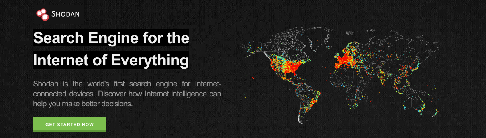

<FeatureCard
  title="Data Display 1 - Shodan"
  color="dark"
  >

</FeatureCard>

<AnchorLinks>
  <AnchorLink>Description</AnchorLink>
  <AnchorLink>Metadata</AnchorLink>
  <AnchorLink>Data</AnchorLink>

</AnchorLinks>

***

## Description

We used CIDR search on Shodan to collect a list of connected devices from top 2 hospitals in US: New York-Presbyterian (CIDR - 143.104.0.0/16) and Cleveland Clinic (CIDR - 192.35.79.0/24)

Number of Unique Records: 421

Date: Extracted from Shodan on October 3rd, 2021

***

## Metadata

***

## Data

| asn | dataa | ip | ip_str | port | timestampp | hostnames | domains | area_code | city | country_code | country_code3 | country_name | dma_code | latitude |
| --- | --- |
| git status   | git status     | git status    | git diff     | git diff       | git diff      | git status   | git status     | git status    | git diff     | git diff       | git diff      | git status   | git status     | git status    |
| git status   | git status     | git status    | git diff     | git diff       | git diff      | git status   | git status     | git status    | git diff     | git diff       | git diff      | git status   | git status     | git status    |
