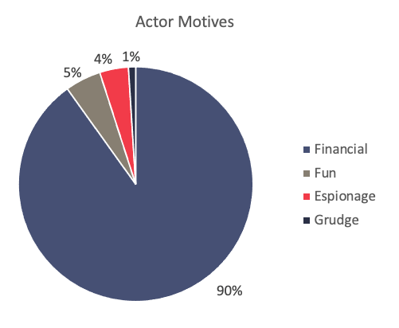
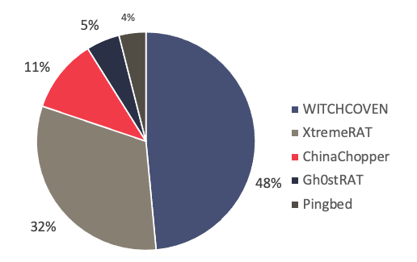

<FeatureCard
  title="Relevant Threat Trends within Hospitals"
  color="dark"
  >

</FeatureCard>

<AnchorLinks>
  <AnchorLink>Relevant Threats</AnchorLink>
  <AnchorLink>Malware & Ransomware</AnchorLink>
  <AnchorLink>Social Engineering & Phishing</AnchorLink>
  <AnchorLink>Distributed Denial of Service (DDoS)</AnchorLink>
</AnchorLinks>

***

## Relevant Threats

According to EY the most relevant threats include (Lovejoy, 2020).
  1. Malware
  2. Ransomware
  3. Social Engineering & Phishing
  4. Distributed Denial of Service (DDoS)

Verizon’s 2021 Data Breach Report stated that the healthcare industry has seen a shift from breaches caused by internal actors to primarily external actors (Verizon, 2020).

Additionally, the data compromised from most hospital breaches include personal, medical, financial and credential information (Verizon, 2020). 

The pie chart below shows the actors motives according to Verizon (Verizon, 2020).

  

***

## Malware & Ransomware

Malware and Ransomware continue to be two of the most severe threats facing the hospital industry today. According to EY, cybercrime groups are targeting hospitals by conducting widespread scans of the internet for vulnerable enterprise assets, such as unpatched VPN servers (Lovejoy, 2020). If found, these actors can use publicly available exploits or credentials from third-party leaks to gain access to the network. They can then find and steal sensitive information and encrypt it with ransomware. This could prevent hospitals from accessing patient medical records, dosages of drugs that patients require, or other critical information (Lovejoy, 2020).

### Top 5 Malware Families

Below is a pie chart that identifies the top 5 malware families within healthcare according to FireEye (FireEye, n.d.).

  

***

## Social Engineering & Phishing

According to the 2020 Healthcare Information and Management System Society (HIMSS) Cybersecurity Report, social engineering and phishing are considered two of the primary means of how threat actors can gain access to a health organizations systems and networks (Healthcare Information and Management System Society, 2020). FireEye states that most threats are either general phishing or spear-phishing that occur via e-mail (FireEye, n.d.). The motives of these threat actors are mainly for financial information, but also include patient information and disruption to the organizations systems and networks.

***

## Distributed Denial of Service (DDoS)

According to Verizon, with the recent explosion of the Internet of Things (IoT) and cloud computing, we’ve seen a spike in the number of DDoS attacks over the last several years (Verizon, 2021). In 2018, a hacktivist was convicted for launching a massive DDoS attack on Boston Children’s Hospital that disrupted their network for 2 weeks. EY states that DDoS attacks can severely impact hospitals with lesser defense capabilities, essentially halting its operations (Verizon, 2020). Ramifications of a DDoS attack can be catastrophic, especially right now because of the pandemic.
