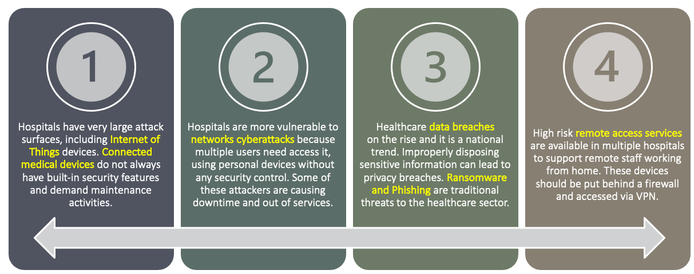
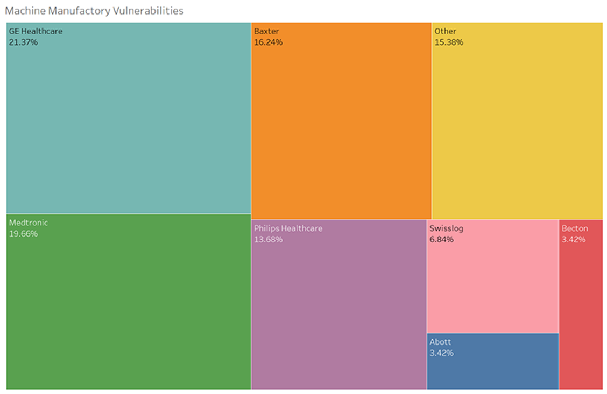
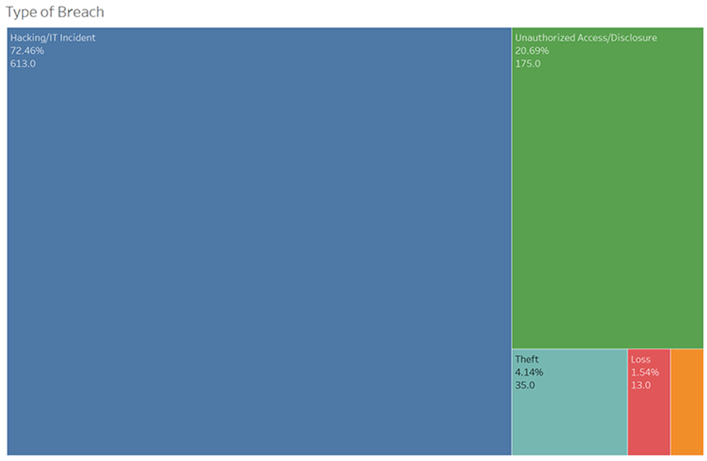
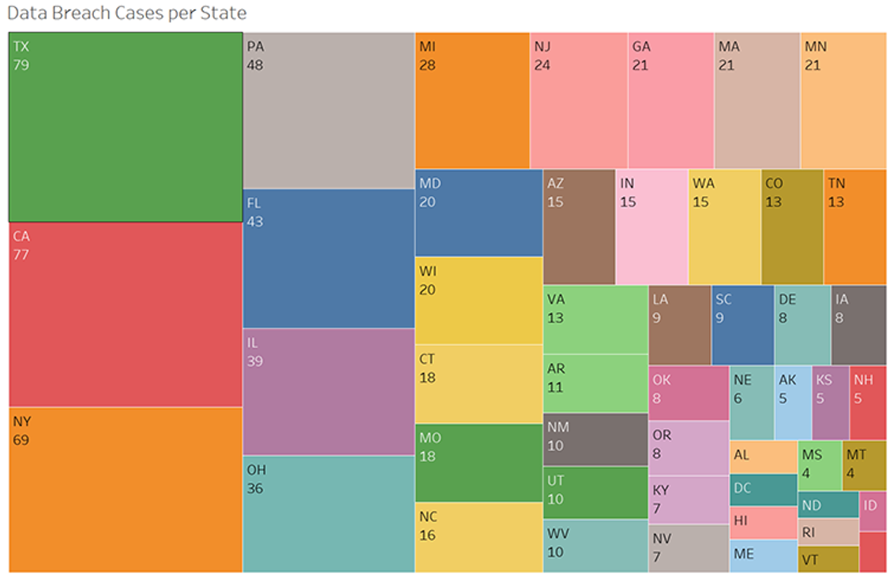
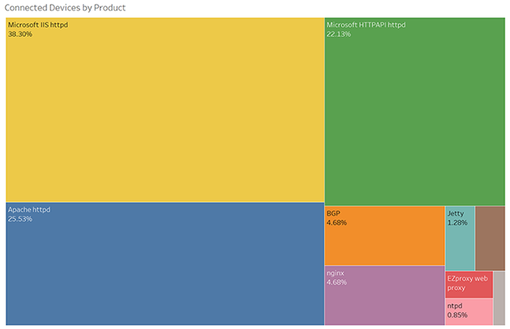

<FeatureCard
  title="Key Insights & Intelligence"
  color="dark"
  >

</FeatureCard>

<AnchorLinks>
  <AnchorLink>Key Insights & Intelligence Summary</AnchorLink>
  <AnchorLink>Key Insight - Connected Medical Devices</AnchorLink>
  <AnchorLink>Key Insight - Network Cyberattacks</AnchorLink>
  <AnchorLink>Key Insight - Data Breaches</AnchorLink>
  <AnchorLink>Key Insight - Remote Access Services</AnchorLink>
</AnchorLinks>

***

## Key Insights & Intelligence Summary

***

## Key Insight - Connected Medical Devices

We found that the top software products(Microsoft IIS and Apache httpd) exposed on these publicly accessible IP addresses may include remote access services (e.g., SSH, VNC, Apple Remote Desktop, and Remote Desktop Protocol). This includes high-risk protocols that may not be encrypted by default, such as VNC. TCP connection is also not encrypted by default which is still being used widely.

As a best practice we implement the rule of Zero Trust where every publicly hosted domain is behind firewall and accessed through network hardened proxy servers. And access is granted in accordance with least access privilege required for the user/identity.

***

## Key Insight - Network Cyberattacks

Data Breaches cases were cause by Hacking/IT Incidents in more than 72% of the case.

Unauthorized access also made a 20% share on the type of breach. Following strict protocol awareness and security procedures as well as training is necessary to prevent these types of attacks.

Without secure access control, hackers can infiltrate the network at one point and then move freely once inside.

The hospital network becomes more vulnerable to cyberattacks when clinicians connect personal devices.

***

## Key Insight - Data Breaches

Data Breaches cases are spread throughout the USA in each state. Highest number of breaches have occurred in Texas and California. 7 States make up to almost 40% of the breaches and are also the most populous states in the country.

There is a need for urgency to prepare and design the hospital infrastructure for an eventual cyberactivity. 

Hospital infrastructure is critical more than ever in a post-covid situation and should always follow security guidelines to keep the lights on.

***

## Key Insight - Remote Access Services

We found that the top software products(Microsoft IIS and Apache httpd) exposed on these publicly accessible IP addresses may include remote access services (e.g., SSH, VNC, Apple Remote Desktop, and Remote Desktop Protocol). This includes high-risk protocols that may not be encrypted by default, such as VNC. TCP connection is also not encrypted by default which is still being used widely.

As a best practice we implement the rule of Zero Trust where every publicly hosted domain is behind firewall and accessed through network hardened proxy servers. And access is granted in accordance with least access privilege required for the user/identity.

