<FeatureCard
  title="Diamond Models"
  color="dark"
  >

</FeatureCard>

<AnchorLinks>
  <AnchorLink>Unauthorized access to Cloud Infrastructure</AnchorLink>
  <AnchorLink>Vulnerable Mobile API Attack</AnchorLink>
  <AnchorLink>Physical Theft</AnchorLink>
  <AnchorLink>Vulnerability OS using Remote code execution</AnchorLink>
  <AnchorLink>Unauthorized Remote Access</AnchorLink>
  <AnchorLink>Firmware Attacks</AnchorLink>
  <AnchorLink>Healthcare PII Data Breach</AnchorLink>
  <AnchorLink>Ransomware attack (PII/HIPAA/PCI Breach)</AnchorLink>
  <AnchorLink>Ransomware Attack (ransom demand)</AnchorLink>
  <AnchorLink>Source Code Libraries</AnchorLink>
  <AnchorLink>GitHub PHI Test Data Leak</AnchorLink>
  <AnchorLink>GitHub Data Leak (HardCoded Credentials)</AnchorLink>
  <AnchorLink>Distributed Denial of Service Attack</AnchorLink>
  <AnchorLink>Cyber Spoofing Attack</AnchorLink>
  <AnchorLink>Ransomware Attack</AnchorLink>
</AnchorLinks>

***

## Unauthorized access to Cloud Infrastructure

  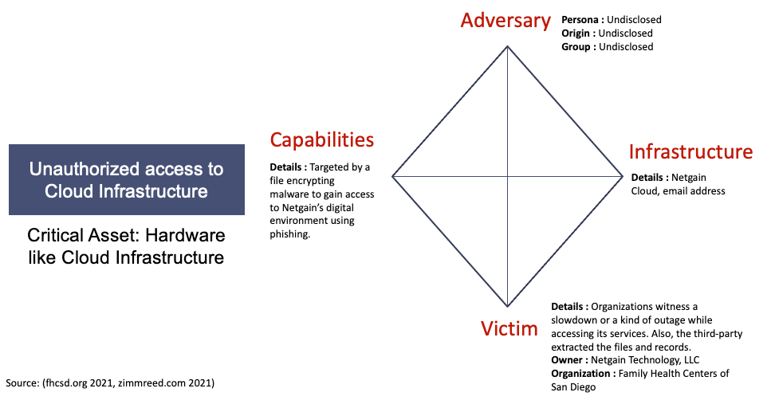

***

## Vulnerable Mobile API Attack

  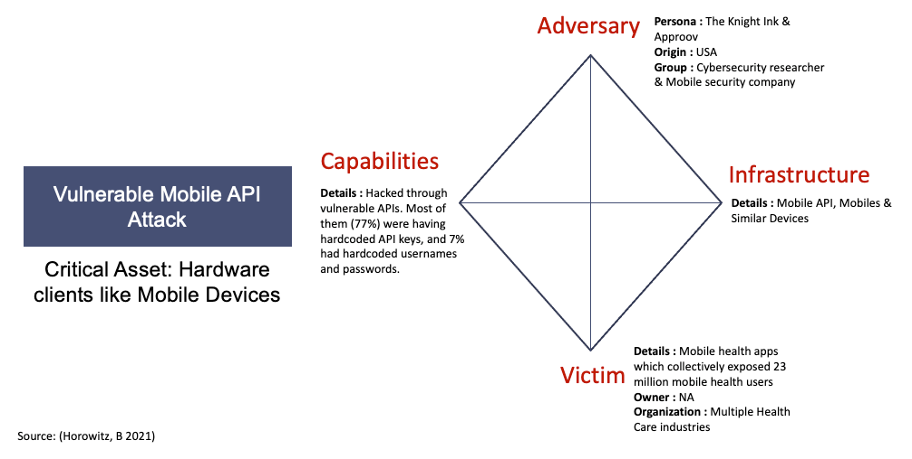

***

## Physical Theft

  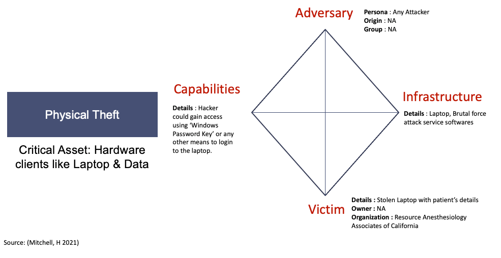

***

## Vulnerability OS using Remote code execution

  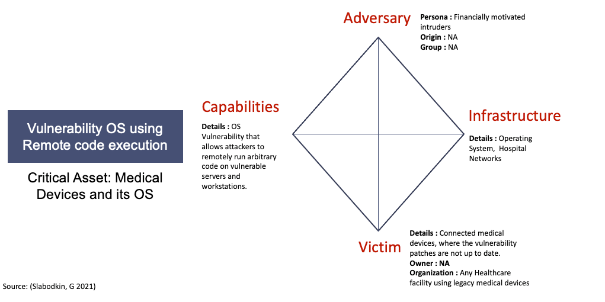

***

## Unauthorized Remote Access

  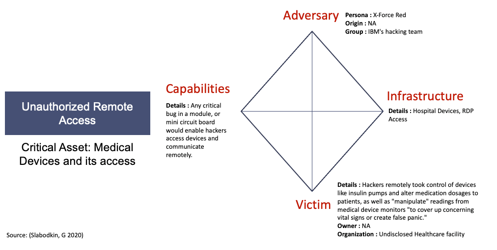

***

## Firmware Attacks

  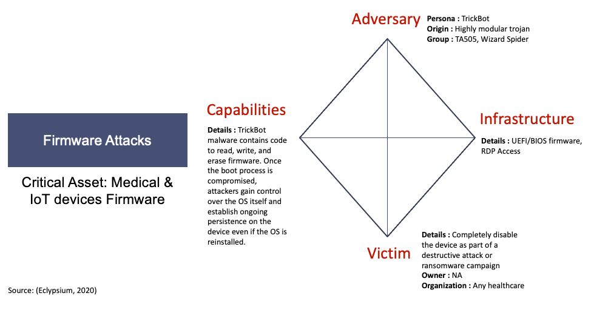

***

## Healthcare PII Data Breach

  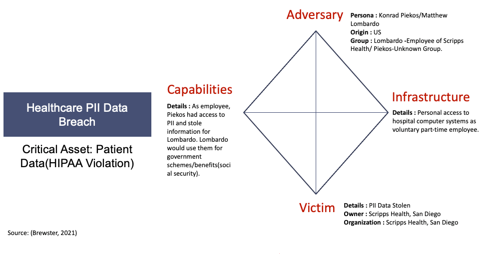

***

## Ransomware attack (PII/HIPAA/PCI Breach)

  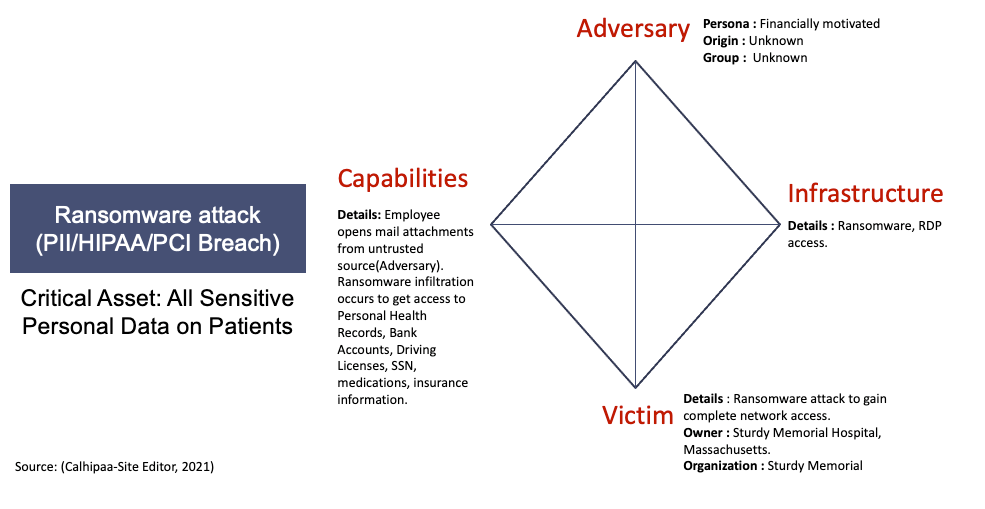

***

## Ransomware Attack (ransom demand)

  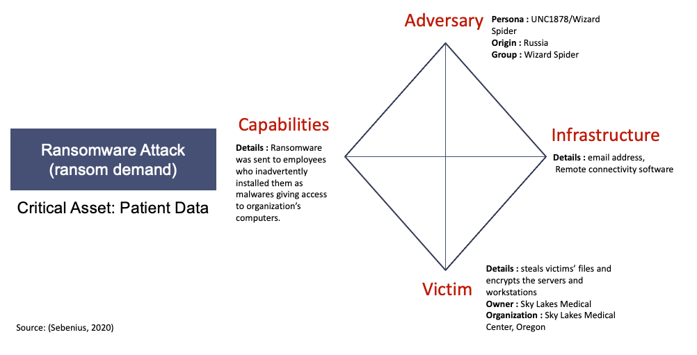

***

## Source Code Libraries

  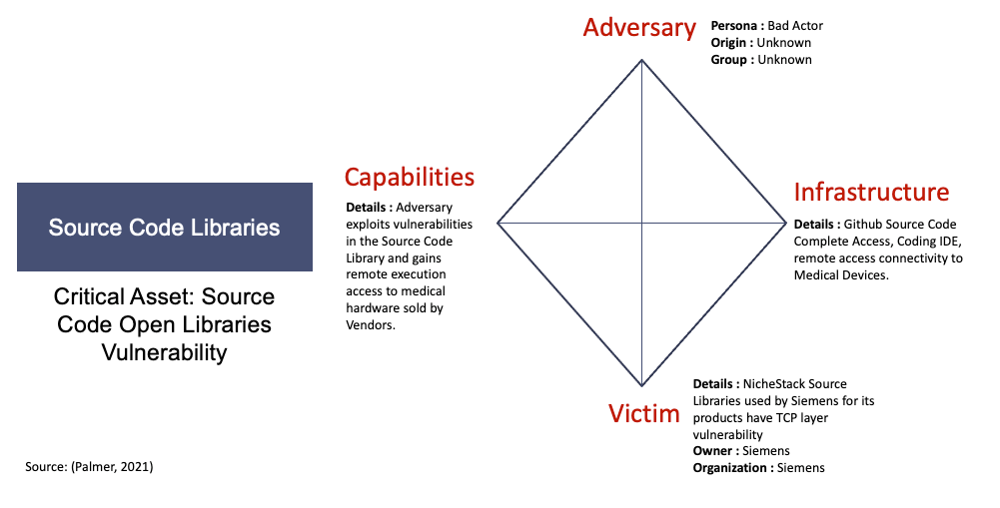

***

## GitHub PHI Test Data Leak

  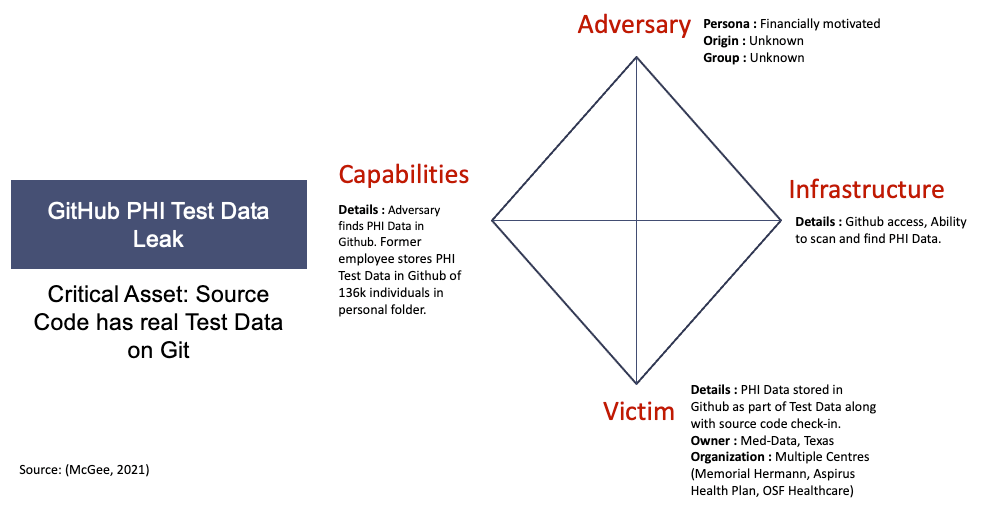

***

## GitHub Data Leak (HardCoded Credentials)

  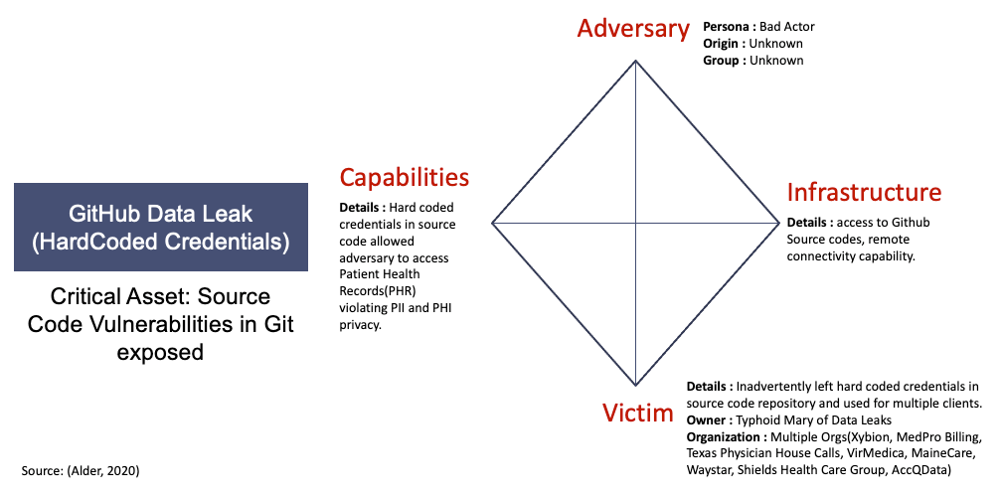

***

## Distributed Denial of Service Attack

  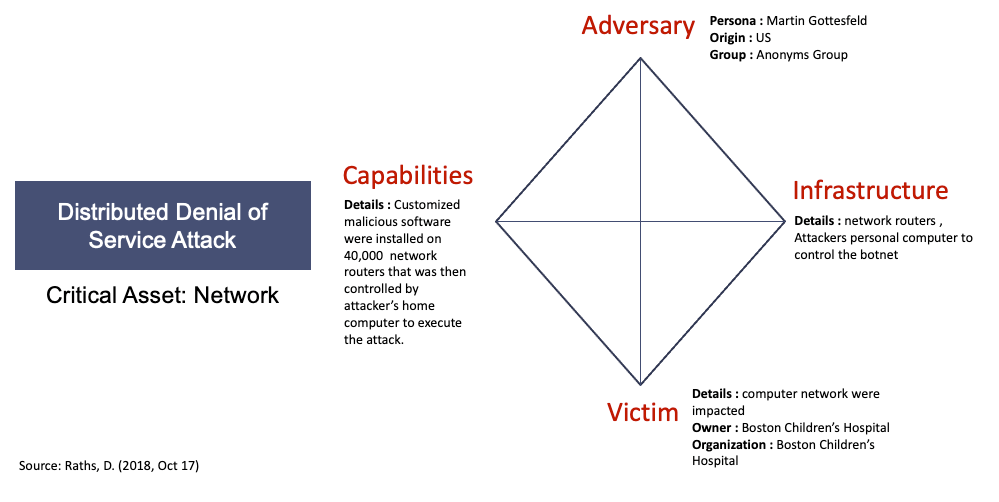

***

## Cyber Spoofing Attack

  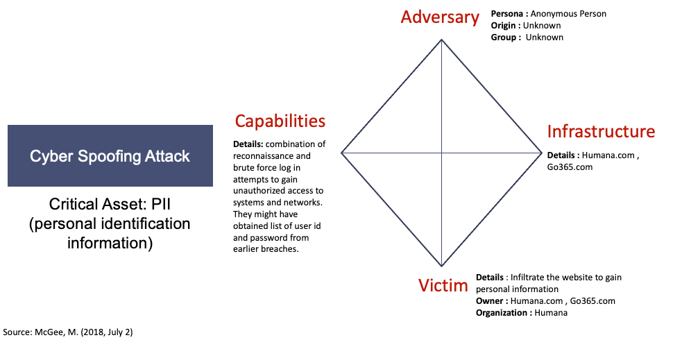

***

## Ransomware Attack

  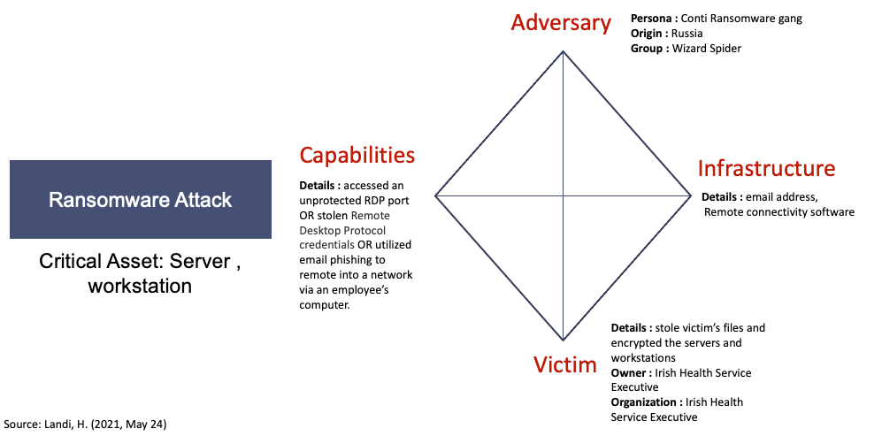
