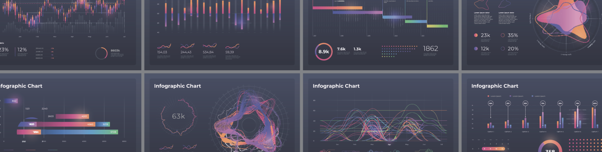
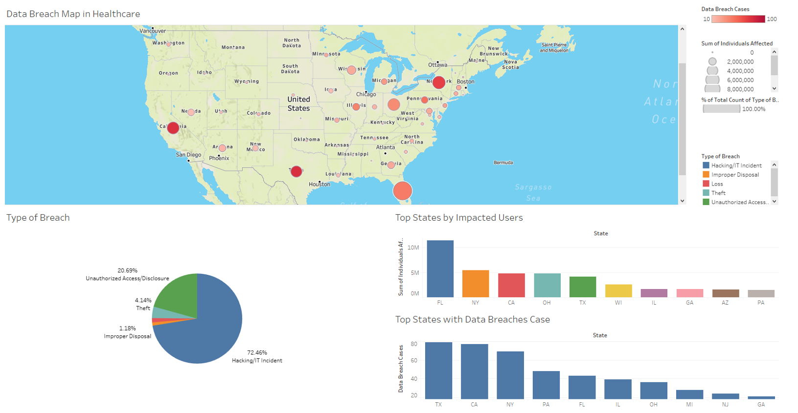

<FeatureCard
  title="Visualization 1 - Geospatial Visualization of Data Beaches"
  color="dark"
  >

</FeatureCard>

This visualization represents a geospatial dashboard from healthcare data breaches in the last 12 months from geospatial approach 2. The data source used to make this dashboard was extracted from [U.S. Department of Health and Human Services](https://ocrportal.hhs.gov/ocr/breach/breach_report.jsf).

To create the map we used two dimensions, the sum of individuals affected (size of the bubble) and the count of data breach cases (color of the bubble).

The other supported charts show the Type of Breach cases, Top states by Impacted USers and Top States with Data Breaches Cases.

Please refer to [Analytical Approach 4 page](/analytical/geo/) for details on the process.

