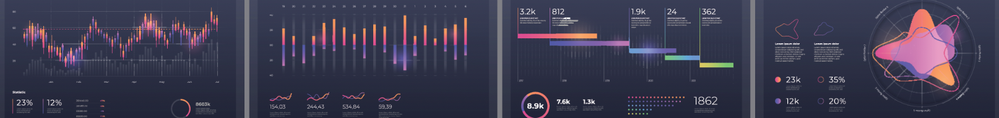
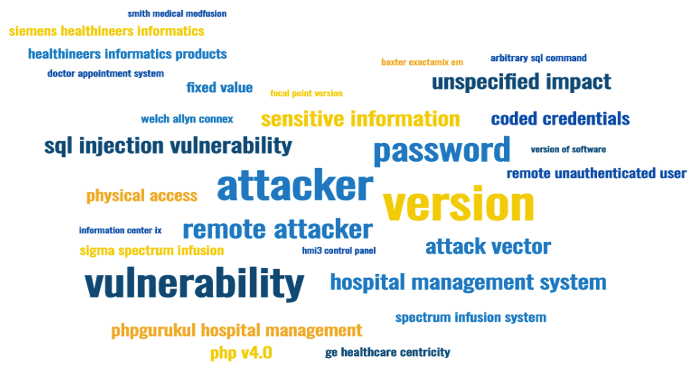

<FeatureCard
  title="Visualization 2 - Word Cloud Visualization"
  color="dark"
  >

</FeatureCard>

This visualization represents a word cloud from analytical approach 2. The data sources used to make this word cloud include datasets from G2, Greenlight Guru and MITRE CVE. Please refer to [Analytical Approach 2 page](/analytical/cve2/) for details on the process.

